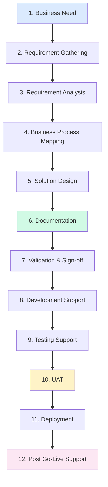
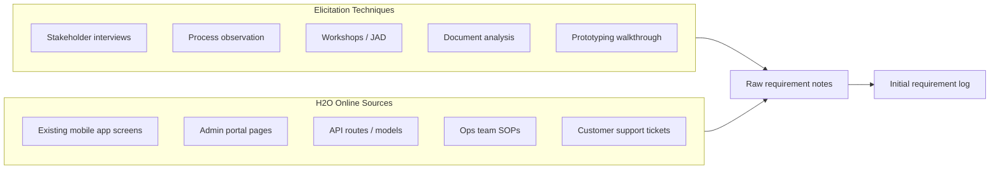
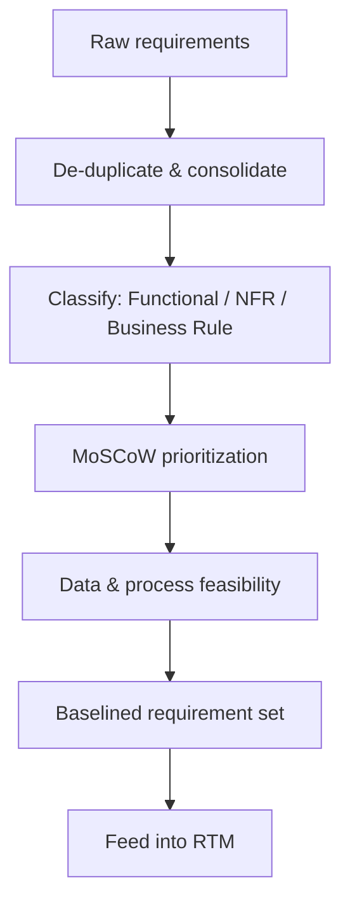
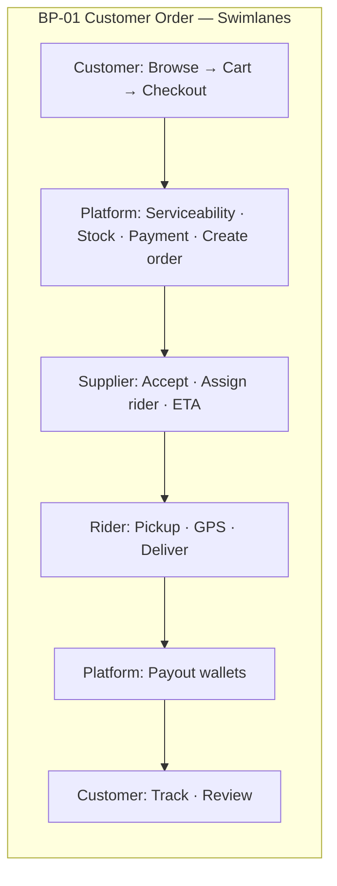
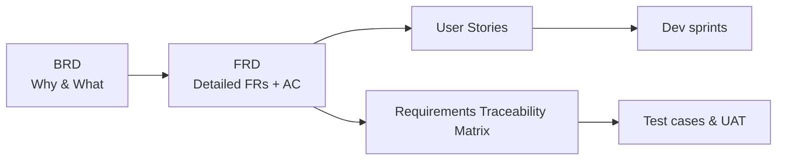
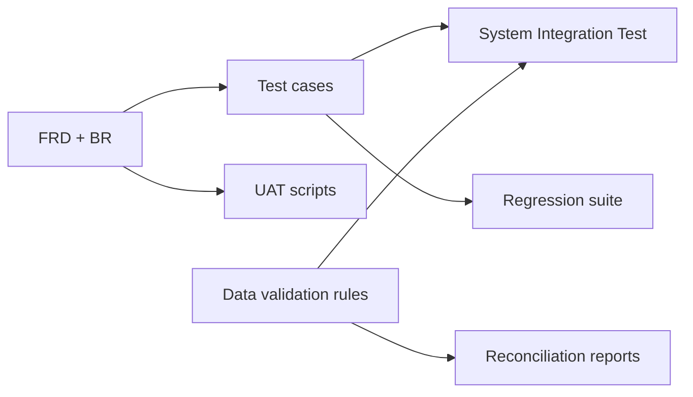
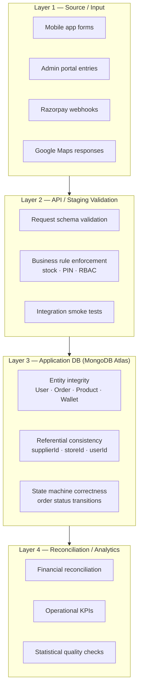

# H2O Online — Business Analyst End-to-End Guide

**Document type:** BA Playbook · Interview Preparation · Process & Methodology Guide  
**Version:** 1.0  
**Audience:** Business Analysts, Product Owners, QA Leads, Delivery Managers  
**Project:** H2O Online — Multi-sided Water Delivery Platform

---

## How to Use This Guide

This document is the **single reference for a Business Analyst** working on H2O Online. Use it to:

1. **Explain the project** to stakeholders in interviews or kickoff meetings  
2. **Follow the end-to-end BA lifecycle** from business need through post go-live  
3. **Know which artifacts to create** (BRD, FRD, process maps, RTM, UAT pack)  
4. **Run validation** — functional, data, statistical, and analytics layers  
5. **Support testing and UAT** with traceable acceptance criteria  

**Related project documents:**

| Document | BA use |
|----------|--------|
| `docs/requirement-capture.md` | Master FRD-style requirement catalogue |
| `docs/BUSINESS-USE-CASE-PUNE.md` | City launch & operations context |
| `docs/SYSTEM-ARCHITECTURE.md` | Technical flows for solution alignment |
| `docs/customer-dashboard-devices-leaderboard-brd.md` | Sample feature-level BRD |

---

## Part A — Explaining the Project (Interview & Stakeholder Prep)

### A.1 The 30-Second Pitch

> **H2O Online** is a multi-sided water delivery platform. Customers order water jars and subscriptions on a mobile app. Verified **suppliers** fulfil orders and assign **riders**. An **admin portal** runs the business — partner verification, service zones by PIN code, stock, wallets, and financials. The platform earns through **supplier commission** (~20%) and manages **rider payouts** (~10% of order value). Beyond delivery, it includes **wallet payments**, **Groq AI hydration insights**, and **Google Maps** for ETA and serviceability.

### A.2 The 2-Minute Stakeholder Explanation

| Question stakeholders ask | BA answer (H2O Online) |
|---------------------------|------------------------|
| **What problem does it solve?** | Fragmented phone/WhatsApp water ordering — no tracking, no subscriptions, no verified supply chain |
| **Who uses it?** | Customers, water suppliers, delivery riders, society/corporate buyers (partial), admin ops team |
| **How does money flow?** | Customer pays (wallet/Razorpay/COD) → on delivery, platform splits to supplier wallet + rider wallet minus commission |
| **What makes it different?** | Verification gate, PIN-based serviceability, stock at order time, subscription billing, AI engagement |
| **What's live vs planned?** | Customer/supplier/rider/admin flows live; corporate demo UI; coupons/OTP/live map tracking partial |
| **What would a BA own?** | Requirements from stakeholders, process maps, BRD/FRD, acceptance criteria, UAT, data validation rules |

### A.3 Five Things a BA Must Internalise

1. **Multi-sided marketplace** — requirements must be written **per actor** (customer, supplier, rider, admin)  
2. **Order is the core transaction** — stock deduct, serviceability, payout on deliver  
3. **Admin is the control tower** — verification, zones, financials, support  
4. **Not everything in the UI is implemented** — BA must maintain **As-Is vs To-Be** gap list  
5. **Data integrity matters** — wallet balances, stock counts, commission math must reconcile  

---

## Part B — BA Lifecycle Overview



### B.1 BA Lifecycle — Phase Summary

| Phase | BA primary outputs | H2O Online focus |
|-------|-------------------|------------------|
| 1. Business Need | Problem statement, business case, objectives | BO-01 to BO-07 from requirement capture |
| 2. Requirement Gathering | Interview notes, workshop outputs, stakeholder register | 5 personas + admin roles |
| 3. Requirement Analysis | Prioritised backlog, MoSCoW, gap analysis | Live vs partial features |
| 4. Business Process Mapping | As-Is / To-Be BPMN, swimlanes | Order, subscription, onboarding flows |
| 5. Solution Design | BRD sections, business rules, wireframe briefs | Mobile + admin + API alignment |
| 6. Documentation | BRD, FRD, user stories, RTM | FR-xxx IDs, BR-xxx rules |
| 7. Validation & Sign-off | Review pack, signed BRD/FRD | PO + Sponsor sign-off |
| 8. Development Support | Clarifications, change requests | API ↔ screen traceability |
| 9. Testing Support | Test scenarios, expected results | Per FR ID |
| 10. UAT | UAT scripts, defect log, sign-off | Role-based UAT packs |
| 11. Deployment | Release notes, training, go-live checklist | AWS prod, Pune launch |
| 12. Post Go-Live | Hypercare log, enhancement backlog | KPI monitoring, data reconciliation |

---

## Part C — Phase-by-Phase BA Playbook

### Phase 1 — Business Need

**Objective:** Confirm *why* the project exists and what success looks like.

#### BA activities

| Activity | Deliverable | H2O Online example |
|----------|-------------|---------------------|
| Identify business problem | Problem statement | Offline water ordering lacks tracking, subscriptions, trust |
| Define business objectives | Objective table (BO-xx) | BO-01 order journey, BO-02 subscriptions, BO-03 partner scale |
| Identify stakeholders | Stakeholder register | Product owner, ops head, suppliers, riders, customers, dev lead |
| Assess current state | As-Is summary | Phone orders, cash, no central admin |
| Define success metrics | KPI list | Orders/week, fulfilment %, subscription conversion |
| Scope boundaries | In / out of scope | Corporate demo = out; customer order = in |

#### Stakeholder register template

| Stakeholder | Role | Interest | Influence | BA engagement |
|-------------|------|----------|-----------|---------------|
| Product Owner | Sponsor | ROI, roadmap | High | Weekly backlog review |
| City Ops Manager | Admin user | Pune launch | High | Process workshops |
| Supplier rep | Supply side | Orders, payouts | Medium | Journey walkthrough |
| Delivery lead | Fulfilment | Rider assignment | Medium | SLA definition |
| Customer support | Operations | Tickets | Medium | Support workflow FRs |
| Tech Lead | Delivery | Feasibility | High | FR review, API mapping |
| QA Lead | Quality | Test coverage | Medium | RTM, UAT plan |

#### Business objectives (reference — from project)

| ID | Objective | BA traceability |
|----|-----------|-----------------|
| BO-01 | On-demand + scheduled ordering | FR-CUS-10 to FR-CUS-29, order workflow |
| BO-02 | Subscription recurring revenue | FR-CUS-37 to FR-CUS-44, Workflow B |
| BO-03 | Verified partner onboarding | FR-SUP-12, FR-DEL-13, FR-ADM-06 to 11 |
| BO-04 | Transparent partner economics | FR-SUP-09/10, FR-DEL-09, BR-05 |
| BO-05 | Central admin operations | FR-ADM-01 to FR-ADM-27 |
| BO-06 | Engagement beyond ordering | FR-CUS-45 to 49, AI features |
| BO-07 | Trust via verification + support | FR-CUS-50 to 52, BR-01 |

---

### Phase 2 — Requirement Gathering

**Objective:** Elicit needs from all actors without solution bias.



#### Requirement gathering plan by actor

| Actor | Key questions | Sessions | Output |
|-------|---------------|----------|--------|
| **Customer** | How do you choose supplier? Address pain? Payment preference? | 2 interviews + app walkthrough | Customer journey FRs |
| **Supplier** | Accept/reject rules? Stock update frequency? Rider model? | 2 interviews | Supplier FRs + BRs |
| **Rider** | Online hours? Pickup proof? Earnings visibility? | 1 interview | Delivery FRs |
| **Admin** | Verification checklist? Financial access? Zone setup? | 2 workshops | Admin FRs + RBAC matrix |
| **Product Owner** | Priority? Launch city? Revenue model? | Ongoing | Prioritised backlog |

#### Requirement gathering checklist

- [ ] Stakeholder register approved  
- [ ] Interview guide per persona completed  
- [ ] As-Is process documented (phone order flow)  
- [ ] Demo of mobile app (customer, supplier, rider paths)  
- [ ] Demo of admin portal (all nav groups)  
- [ ] Review `requirement-capture.md` for baseline  
- [ ] Gap list: UI-only vs backend-implemented  
- [ ] Non-functional needs captured (SLA, security, privacy)  
- [ ] Assumptions and constraints log started  

#### Sample interview questions — Customer

1. Walk me through your last water order outside the app.  
2. What information do you need while waiting for delivery?  
3. Would you prepay via wallet? What would make you trust it?  
4. How important are subscriptions vs one-time orders?  
5. What would make you abandon checkout? (address, stock, payment)  

#### Sample interview questions — Admin Ops

1. How do you decide if a supplier is approved?  
2. How do you define which PIN codes are serviceable?  
3. What do you do when a supplier rejects an order?  
4. How do you reconcile rider and supplier payouts weekly?  
5. Which reports do you need on day 1 of Pune launch?  

---

### Phase 3 — Requirement Analysis

**Objective:** Structure, prioritise, and validate requirements for consistency and feasibility.

#### Analysis techniques on this project

| Technique | Application |
|-----------|-------------|
| **MoSCoW** | Must = order + pay + deliver; Should = AI insights; Could = coupons |
| **Gap analysis** | Compare UI (coupon field) vs API (not implemented) |
| **Dependency mapping** | Serviceability before checkout; verify before supplier dashboard |
| **Conflict resolution** | Sub-admin wants financials vs BR-06 RBAC |
| **Feasibility review** | Tech lead confirms Razorpay verify flow vs direct order |
| **Impact analysis** | Change to commission % affects supplier financials + admin reports |



#### Requirement types and ID scheme

| Type | Prefix | Example | Document |
|------|--------|---------|----------|
| Business objective | BO-xx | BO-02 subscriptions | BRD §2 |
| Business rule | BR-xx | BR-01 verify before transact | BRD §Business Rules |
| Functional requirement | FR-xxx-yy | FR-CUS-18 select address | FRD |
| Non-functional | NFR-xx | NFR-05 real-time tracking | BRD §NFR |
| User story | US-xxx | As a customer I want… | Backlog / sprint |
| Acceptance criterion | AC-xxx | Given… When… Then… | FRD / UAT |
| Backlog item | BL-xx | BL-04 coupon engine | Future scope |

#### Gap analysis template (H2O Online — examples)

| Feature (UI) | Backend/API | Gap | BA recommendation |
|--------------|-------------|-----|-------------------|
| Coupon at checkout | Not implemented | High | BL-04; remove from Must FR or mark Could |
| OTP login | Mock flow | High | BL-05; document as non-prod |
| Live map on track screen | Partial / placeholder | Medium | BL-06; UAT uses status timeline only |
| Loyalty points display | Display only | Low | Document as cosmetic until BL-03 |
| Razorpay pay | Implemented verify flow | None | FR-CUS-23 updated to include Razorpay path |
| Stock check | Implemented on order | None | Include in UAT stock scenarios |

---

### Phase 4 — Business Process Mapping

**Objective:** Visualise how work flows across people, systems, and data.

#### Processes the BA must map (minimum set)

| Process ID | Name | Actors | Priority |
|------------|------|--------|----------|
| BP-01 | Customer one-time order | Customer, Platform, Supplier, Rider | Critical |
| BP-02 | Subscription lifecycle | Customer, Admin, Rider | Critical |
| BP-03 | Supplier onboarding | Supplier, Admin | Critical |
| BP-04 | Rider onboarding & fulfilment | Rider, Supplier, Admin | Critical |
| BP-05 | Store approval | Supplier, Admin | High |
| BP-06 | Serviceability & address | Customer, Admin, Google Maps | High |
| BP-07 | Payment & wallet settlement | Customer, Platform, Supplier, Rider | Critical |
| BP-08 | Customer support ticket | Customer, Admin | Medium |
| BP-09 | Admin daily operations | Admin, Sub-admin | High |



#### As-Is vs To-Be template

| Step | As-Is (offline Pune vendor) | To-Be (H2O Online) | System touchpoint |
|------|----------------------------|--------------------|-------------------|
| Order | Phone call / WhatsApp | App checkout | POST /api/orders |
| Address | Verbal | Saved address + PIN + map | /api/addresses |
| Payment | Cash on delivery | Wallet / Razorpay / COD | payments + wallet |
| Assign delivery | Vendor's own staff | Supplier assigns rider in app | supplier orders API |
| Track | Call vendor | Order tracking API | /api/orders/:id/tracking |
| Complaint | Phone | Support ticket | /api/customer-support |

---

### Phase 5 — Solution Design (BA Contribution)

**Objective:** Translate business needs into solution boundaries the dev team can build.

**Note:** Solution *architecture* is owned by Tech Lead; BA contributes **business solution design**.

| BA deliverable | Content |
|----------------|---------|
| Solution scope diagram | Mobile + Admin + API + MongoDB + 3rd parties |
| Business rules catalogue | BR-01 to BR-10 |
| Entity glossary | User, Order, Supplier, Store, ServiceableArea, Wallet |
| Integration list | Groq, Google Maps, Razorpay, MongoDB Atlas |
| Role-permission matrix | Admin RBAC |
| Wireframe / screen inventory | Reference `docs/screens-catalog.json` |
| API-to-requirement map | Which FR maps to which endpoint |



---

### Phase 6 — Documentation

**Objective:** Produce controlled, versioned artifacts stakeholders can sign off.

#### Document hierarchy

| Document | Purpose | Owner | Audience |
|----------|---------|-------|------------|
| **BRD** (Business Requirements Document) | Business need, objectives, scope, processes, rules, NFRs | BA | Sponsor, PO, Ops |
| **FRD** (Functional Requirements Document) | Detailed FR-IDs, acceptance criteria, screen behaviour | BA | Dev, QA, PO |
| **RTM** (Requirements Traceability Matrix) | FR → Design → Test → UAT link | BA | QA, PM |
| **Process maps** | BPMN / swimlanes | BA | All stakeholders |
| **Data dictionary** | Field definitions for orders, wallet, stock | BA + Tech | Dev, analytics |
| **UAT pack** | Scripts per role | BA + QA | Business users |
| **Release notes** | What's in this release | BA + Dev | Ops, support |

#### BRD — Standard sections (H2O Online template)

1. **Executive summary** — 1 page business narrative  
2. **Business objectives** — BO-01 to BO-07 with KPIs  
3. **Stakeholders & personas** — customer, supplier, rider, admin  
4. **Scope** — in scope / out of scope / assumptions  
5. **Business process overview** — BP-01 to BP-09 summaries  
6. **Business rules** — BR-01 to BR-10  
7. **Business capabilities** — wallet, commission, AI, support  
8. **Non-functional requirements** — NFR-01 to NFR-10  
9. **Financial / commercial rules** — commission 20%, rider 10%  
10. **Risks & dependencies** — Razorpay, Maps API, verification SLA  
11. **Success criteria & sign-off** — measurable outcomes  

**Existing BRD example:** `docs/customer-dashboard-devices-leaderboard-brd.md`

#### FRD — Standard sections (H2O Online template)

1. **Introduction & references** — link to BRD  
2. **Functional requirements by module**  
   - FR-AUTH-xx Authentication  
   - FR-CUS-xx Customer  
   - FR-SUP-xx Supplier  
   - FR-DEL-xx Delivery partner  
   - FR-ADM-xx Admin  
3. **Acceptance criteria** per FR (Given/When/Then)  
4. **UI screen mapping** — screen name → FR IDs  
5. **API mapping** — endpoint → FR IDs  
6. **Error & edge cases** — stock-out, unserviceable PIN, reject order  
7. **Open issues & TBD log**  

**Master FR catalogue:** `docs/requirement-capture.md` (use as FRD baseline)

#### User story format (for backlog)

```
As a [supplier in Pune]
I want to [accept an incoming order and assign a rider]
So that [the customer receives delivery within SLA]

Acceptance criteria:
- AC-1: Given pending order, when supplier taps Accept, then status = accepted
- AC-2: Given accepted order, when rider selected, then deliveryPartnerId saved
- AC-3: Given no riders online, then UI shows warning (partnerAvailability)

Linked: FR-SUP-04, FR-SUP-06, BP-01
```

#### Requirements Traceability Matrix (RTM) — sample rows

| FR ID | BRD objective | Process | API / Component | Test case | UAT script |
|-------|---------------|---------|-----------------|-----------|------------|
| FR-CUS-18 | BO-01 | BP-01 | CheckoutScreen, /api/addresses | TC-ORD-012 | UAT-C-05 |
| FR-CUS-18 | BO-01 | BP-06 | /api/serviceability/check | TC-ORD-013 | UAT-C-06 |
| FR-SUP-04 | BO-01 | BP-01 | PATCH …/orders/:id/accept | TC-SUP-003 | UAT-S-02 |
| FR-DEL-03 | BO-01 | BP-04 | PATCH …/picked-up | TC-RID-002 | UAT-R-02 |
| FR-ADM-06 | BO-03 | BP-03 | Admin Suppliers verify | TC-ADM-004 | UAT-A-03 |
| FR-ADM-20 | BO-05 | BP-07 | Wallet management | TC-ADM-010 | UAT-A-08 |

---

### Phase 7 — Validation & Sign-off

**Objective:** Confirm requirements are complete, correct, and agreed before build/test at scale.

| Review type | Participants | BA role | Exit criteria |
|-------------|--------------|---------|---------------|
| **Business review** | PO, Ops, Sponsor | Present BRD | Objectives & scope signed |
| **Functional review** | PO, Dev, QA | Present FRD + RTM | No open Must gaps |
| **Technical review** | Tech Lead, Dev | Clarify API mapping | Feasibility confirmed |
| **Compliance review** | Legal / PO | Privacy, GST, FSSAI notes | NFR sign-off |

#### Sign-off checklist

- [ ] All Must-have FRs have acceptance criteria  
- [ ] Business rules validated with Ops (commission, verification)  
- [ ] Out-of-scope items explicitly listed (coupons, OTP)  
- [ ] RTM covers all Must FRs  
- [ ] Assumptions documented and accepted  
- [ ] Sign-off sheet completed (see `requirement-capture.md` §18)  

---

### Phase 8 — Development Support

**Objective:** Answer clarifications and manage controlled change during build.

| Activity | BA action | Tool / artifact |
|----------|-----------|-----------------|
| Clarification requests | Respond within SLA; update FR if needed | CR log |
| Sprint refinement | Explain user story context | Backlog |
| API contract review | Map request/response to FR | Postman / OpenAPI notes |
| Change request | Impact: FR, RTM, test, UAT | Change impact matrix |
| Demo attendance | Verify against acceptance criteria | Sprint demo checklist |

#### Change impact matrix template

| Change | Affected FRs | Processes | Test impact | UAT impact | Approval |
|--------|--------------|-----------|-------------|------------|----------|
| Add PIN radius 15km | FR-ADM serviceable areas | BP-06 | TC-SVC-* | UAT-A-12 | PO |

---

### Phase 9 — Testing Support

**Objective:** Ensure QA can trace tests to requirements and business rules.



#### Test scenario categories (H2O Online)

| Category | Examples | Linked rules |
|----------|----------|--------------|
| **Happy path** | End-to-end order delivered | BP-01 |
| **Negative** | Stock-out, invalid PIN, wrong password | BR + validations |
| **RBAC** | Sub-admin blocked from financials | BR-06, FR-ADM-23 |
| **Integration** | Razorpay verify → order create | Payment flow |
| **Boundary** | stockQty = 0, radius edge PIN | Serviceability |
| **Concurrency** | Two orders last jar | Stock deduct |
| **Financial** | Payout math on deliver | BR-05, 10% rider |

#### BA test support deliverables

1. **Test scenario document** — business scenarios in plain language  
2. **Expected result per FR** — from acceptance criteria  
3. **Test data spec** — users, suppliers, PINs, products, stock levels  
4. **Defect triage rules** — Must FR failure = blocker  

---

### Phase 10 — UAT (User Acceptance Testing)

**Objective:** Business users confirm the system meets agreed requirements before go-live.

#### UAT methodology for H2O Online

| Step | Activity | Owner |
|------|----------|-------|
| 1 | Define UAT scope (Must FRs only for pilot) | BA + PO |
| 2 | Create role-based UAT packs | BA |
| 3 | Prepare UAT environment + test data | QA + Ops |
| 4 | Train UAT participants (30 min per role) | BA |
| 5 | Execute UAT scripts; log defects | Business users |
| 6 | BA triages defects: bug vs change vs training | BA |
| 7 | Re-test fixes | Business users |
| 8 | UAT sign-off memo | PO + Ops |

#### UAT packs by role

| Pack | Tester | Critical scripts |
|------|--------|------------------|
| **UAT-C** Customer | Ops team member | Register, order, pay, track, support ticket |
| **UAT-S** Supplier | Pilot vendor | Onboarding, accept order, assign rider, stock update |
| **UAT-R** Rider | Pilot rider | Go online, pickup, deliver, view earnings |
| **UAT-A** Admin | City manager | Verify supplier, serviceable PIN, orders dashboard, wallet adjust |

#### Sample UAT script — UAT-C-05 (Address & serviceability)

| Step | Action | Expected result | FR ref | Pass/Fail |
|------|--------|-----------------|--------|-----------|
| 1 | Login as customer | Dashboard loads | FR-AUTH-06 | |
| 2 | Add address Kothrud PIN 411038 via map | Address saved | FR-CUS-30/31 | |
| 3 | Add product to cart → checkout | Address pre-selected | FR-CUS-18 | |
| 4 | Proceed with serviceable PIN | Checkout allowed | FR-CUS-18, BP-06 | |
| 5 | Change PIN to invalid 000000 | Serviceability error shown | BP-06 | |
| 6 | Complete order with wallet | Order confirmed | FR-CUS-23/24 | |

#### UAT entry / exit criteria

**Entry:** FRD signed off; SIT complete; critical defects = 0; UAT data loaded  
**Exit:** 100% Must UAT scripts pass; PO sign-off; known issues documented with workaround  

---

### Phase 11 — Deployment

**Objective:** BA ensures business readiness for production go-live.

| BA deliverable | Content |
|----------------|---------|
| **Go-live checklist** | Admin users created, suppliers verified, PINs configured |
| **Release notes** | Features enabled; known limitations (coupons off) |
| **Training materials** | Admin 2hr workshop; supplier quick guide |
| **Support playbook** | Escalation paths, SLAs |
| **Rollback criteria** | Payment failures > X%; API down > Y min |

**Reference:** `docs/DEPLOYMENT-GUIDE.md`, `docs/BUSINESS-USE-CASE-PUNE.md`

---

### Phase 12 — Post Go-Live Support

**Objective:** Hypercare, measure KPIs, feed enhancements back to backlog.

| Activity | Frequency | BA output |
|----------|-----------|-----------|
| Hypercare standup | Daily (week 1) | Issue log |
| KPI review | Weekly | Orders, fulfilment %, stock-out rate |
| Data reconciliation | Weekly | Wallet vs order report |
| Retrospective | End week 2 | Enhancement backlog |
| FR gap review | Monthly | Update gap analysis |

---

## Part D — Data Validation & Analytics Methodology

BA owns **business data rules**; validation spans multiple layers aligned to H2O Online architecture.



### D.1 Layer 1 — Source data validation

| Data element | Business rule | Validation check |
|--------------|---------------|------------------|
| PIN code | 6 digits, serviceable | Regex + serviceability API |
| Email | Unique per user | Register/login |
| stockQty | Non-negative integer | Product create/update |
| Order total | subtotal + tax = total | Billing validation |
| Commission % | 0–100 | Admin supplier settings |
| lat/lng | Required for store | Store creation |

### D.2 Layer 2 — API / staging validation

**Staging environment:** Mirror of prod schema on separate MongoDB database; same API code (`NODE_ENV=staging`).

| Test type | Script / method | BA sign-off focus |
|-----------|-----------------|-------------------|
| Smoke test | `backend/scripts/integration-smoke-test.js` | Health, auth, serviceability |
| Negative API tests | Invalid PIN, insufficient stock | Error messages match FR |
| Payment staging | Razorpay test keys | Verify → order created once |
| RBAC API tests | Sub-admin → financials = 403 | BR-06 |

### D.3 Layer 3 — Application database validation

| Entity | Key fields to validate | SQL-like check (Mongo aggregation concept) |
|--------|------------------------|-------------------------------------------|
| **Order** | status transitions legal | No delivered → in_progress |
| **Order** | supplierResponses match items | One response per supplierId in items |
| **Product** | stockQty ≥ 0 | Count where stockQty < 0 = 0 |
| **Product** | inStock ↔ stockQty | inStock false when qty = 0 |
| **Wallet** | balance = sum(transactions) | Reconciliation query |
| **Wallet** | payout once per order | No duplicate supplier_payout ref |
| **ServiceableArea** | PIN + supplierId unique | No duplicate active zones |
| **User** | role matches linked entity | supplier role → Supplier doc exists |

#### Order state validation rules

| From | To | Allowed? |
|------|-----|----------|
| in_progress | delivered | Yes (via rider deliver) |
| in_progress | cancelled | Yes (customer/supplier) |
| delivered | in_progress | **No — data defect** |
| pending supplier | accepted | Yes |
| accepted | picked_up | Yes |
| picked_up | delivered | Yes |

### D.4 Layer 4 — Reconciliation & analytics validation

#### Financial reconciliation (weekly BA report)

```
Platform revenue (week) = 
  Sum(order.total × commission%) for delivered orders
  + platform retention after rider 10%

Supplier wallet credits = 
  Sum(transactions where ref starts with supplier_payout_)

Rider wallet credits = 
  Sum(transactions where ref starts with delivery_)

Check: supplier_payout + rider_payout + platform_cut ≈ order totals (delivered)
```

| Metric | Formula | Alert threshold |
|--------|---------|-----------------|
| Stock-out rate | Orders failed stock / total attempts | > 3% |
| Fulfilment rate | Delivered / (Delivered + Cancelled) | < 95% |
| Avg delivery time | deliveredAt − createdAt | > 45 min Pune pilot |
| Unserviceable rate | Failed serviceability checks / check calls | Spike > 10% day-over-day |
| Wallet drift | wallet.balance − computed sum(transactions) | ≠ 0 |
| Duplicate payout | Count payout refs per orderId | > 1 |

#### Statistical validation checks

| Check | Method | Purpose |
|-------|--------|---------|
| **Order volume anomaly** | 7-day moving avg ± 2σ | Detect outage or marketing spike |
| **PIN distribution** | Orders by pinCode histogram | Validate zone rollout |
| **Cancellation correlation** | Cancel rate by supplier, hour | Ops improvement |
| **Stock depletion rate** | Δ stockQty vs orders by product | Forecast restock |
| **Subscription churn** | Cancelled subs / active subs | BO-02 health |
| **A/B payment mix** | wallet vs razorpay vs cod % | Payment strategy |

#### Analytics perspectives BA should define

| Perspective | Questions | Data source |
|-------------|-----------|-------------|
| **Customer** | Repeat rate? Avg order value? | Orders by userId |
| **Supplier** | Accept time? Reject rate? | supplierResponses |
| **Rider** | Deliveries/day? Online hours? | DeliveryPartner + orders |
| **Geographic** | Hot PINs? Unserviceable gaps? | Orders + ServiceableArea |
| **Financial** | GMV, take rate, payout lag | Orders + Wallets + Admin financials |
| **Quality** | Review scores, ticket volume | Reviews + Support tickets |

### D.5 Data validation sign-off template

| Layer | Validator | Date | Status | Notes |
|-------|-----------|------|--------|-------|
| L1 Source rules | BA | | | |
| L2 API staging | QA | | | |
| L3 DB integrity | QA + Dev | | | |
| L4 Reconciliation | BA + Finance | | | |
| Analytics KPIs | BA + Ops | | | |

---

## Part E — BA Interview Preparation

### E.1 "Walk me through this project as a BA"

**Structured answer (STAR-style overview):**

1. **Situation:** Fragmented water delivery market; need digital platform for Pune-scale ops  
2. **Task:** Define requirements across 4 actors + admin; ensure traceability to test/UAT  
3. **Action:** Elicited from stakeholders; mapped BP-01 order flow; wrote FR-CUS/SUP/DEL/ADM catalogue; RTM to UAT; data validation on wallet/stock  
4. **Result:** Live platform with order → verify → deliver → payout; admin controls zones and partners  

### E.2 Common interview questions & answers

| Question | Strong BA answer (H2O Online) |
|----------|-------------------------------|
| Who were your stakeholders? | PO, Pune ops (admin), suppliers, riders, customers, tech lead, QA |
| Hardest requirement conflict? | Sub-admin wanted financials vs BR-06 — resolved via RBAC matrix sign-off |
| How did you prioritize? | MoSCoW: order path Must; coupons Could (not built) |
| How do you handle scope creep? | Change impact matrix; PO approves; RTM updated |
| What artifacts did you produce? | BRD objectives, FRD with FR-IDs, process maps, RTM, UAT packs |
| How did you validate data? | 4 layers: input rules, API staging, MongoDB integrity, wallet reconciliation |
| Example business rule? | BR-01: supplier cannot transact until admin verifies documents |
| How does UAT differ from SIT? | SIT = QA technical; UAT = business users confirm FR acceptance criteria |
| How do you trace requirements? | RTM: FR → API → test case → UAT script |
| What metrics matter post launch? | Fulfilment rate, stock-out %, subscription conversion, wallet drift |

### E.3 Whiteboard process — be ready to draw

1. Customer order flow (5 swimlanes)  
2. Supplier onboarding → admin verify  
3. Money flow: pay → deliver → commission split  
4. BA lifecycle from business need to go-live  

---

## Part F — Master Checklists

### F.1 New BA onboarding (Week 1)

- [ ] Read this guide end-to-end  
- [ ] Read `requirement-capture.md`  
- [ ] Walk through mobile app: customer, supplier, rider  
- [ ] Walk through admin portal all modules  
- [ ] Read `SYSTEM-ARCHITECTURE.md` §5–7 (auth, address, order)  
- [ ] Run `integration-smoke-test.js` against staging  
- [ ] Build stakeholder register for your release  
- [ ] Draft RTM skeleton  

### F.2 Pre-UAT checklist

- [ ] All Must FRs have UAT scripts  
- [ ] Test users: 2 customers, 2 suppliers, 3 riders, 3 admin roles  
- [ ] Test PINs configured in serviceable areas  
- [ ] Products with known stockQty  
- [ ] Razorpay test mode documented  
- [ ] Known gaps communicated (coupons, OTP)  

### F.3 Go-live checklist (BA)

- [ ] BRD/FRD signed  
- [ ] UAT sign-off memo archived  
- [ ] L3 + L4 data validation passed  
- [ ] Training completed for admin ops  
- [ ] Support playbook handed to support team  
- [ ] KPI dashboard defined for week 1 hypercare  

---

## Part G — Glossary (BA Quick Reference)

| Term | BA definition |
|------|---------------|
| **Serviceability** | Business rule: customer PIN within supplier zone before order allowed |
| **supplierResponses** | Per-supplier leg of order: pending → accepted/rejected → delivery stages |
| **Commission** | Platform fee % on supplier gross (default 20%) |
| **Delivery share** | Rider portion of order total (10%) |
| **RTM** | Requirements Traceability Matrix |
| **BRD** | Why and what at business level |
| **FRD** | Detailed functional behaviour with IDs |
| **Hypercare** | Intensive support period after go-live |
| **Gap analysis** | UI capability vs backend implementation diff |

---

## Document Sign-Off

| Role | Name | Date | Signature |
|------|------|------|-----------|
| Head of Business Analysis | | | |
| Product Owner | | | |
| QA Lead | | | |
| Project Sponsor | | | |

---

*This BA guide is aligned with H2O Online as implemented: mobile (`mobile/`), admin (`admin/`), backend API (`backend/`), and project documentation in `docs/`.*
