# H2O Online — Business Use Case: Pune City Launch & Operations

**Document type:** Business Operations & Go-to-Market Guide  
**Version:** 1.0  
**City focus:** Pune, Maharashtra, India  
**Platform:** H2O Online (Mobile App + Admin Portal + Backend API)  
**Production stack:** AWS EC2 · MongoDB Atlas · Groq AI · Google Maps · Razorpay

---

## 1. Executive Summary

H2O Online is a **multi-sided water delivery platform** that connects households, societies, and businesses in Pune with verified water suppliers and delivery riders. The platform is not only a customer app — it is an **operations engine** for running a city-scale water delivery business: onboarding vendors, defining service zones by PIN code, tracking stock at store level, matching demand to supply, fulfilling orders end-to-end, and settling payments with commission-based economics.

**Pune opportunity:** Pune Metropolitan Region has 7M+ residents, rapid growth in IT corridors (Hinjewadi, Baner, Wakad), high apartment density, and recurring demand for **20L jar water**, **bulk cans**, and **tanker supply** in areas with irregular municipal supply. Existing delivery is fragmented (local vendors, phone orders, WhatsApp). H2O Online digitises discovery, ordering, tracking, subscriptions, and partner payouts in one system.

**Business proposition for a Pune operator:**

| Stakeholder | Value |
|-------------|-------|
| **Platform owner / franchise** | Commission on GMV, subscription retention, data on demand hotspots |
| **Water supplier** | New digital customers, order queue, rider fleet tools, wallet settlements |
| **Delivery rider** | Assigned jobs, GPS routes, 10% delivery share on order value |
| **Customer** | One app for instant + scheduled delivery, wallet, tracking, subscriptions |
| **Admin team** | Single dashboard for Pune operations — verify partners, zones, stock oversight, support |

This document explains **how to launch and manage** H2O Online in Pune: workflows, stock/demand/supply management, admin roles, and risks.

---

## 2. Pune Market Context

### 2.1 Why Pune

| Factor | Pune relevance |
|--------|----------------|
| Population | ~7M metro; large renter and young professional base |
| Housing | High-rise societies in Kothrud, Baner, Wakad, Hinjewadi, Magarpatta |
| Water need | Jar/can delivery standard; tanker demand in peripheral areas |
| Digital readiness | Strong smartphone penetration; UPI/wallet adoption |
| Competition | Local vendors dominate; no single city-wide digital leader |

### 2.2 Target Customer Segments (Phase 1–3)

| Segment | Pune examples | Platform feature |
|---------|---------------|------------------|
| **Households** | Families in Kothrud, Aundh, Viman Nagar | Instant order, saved addresses, wallet |
| **Societies / RWAs** | Large complexes in Baner, Wakad | Society registration, bulk plans |
| **Offices / startups** | Hinjewadi IT parks, Kharadi | Scheduled orders, subscription billing |
| **PG / co-living** | Areas near colleges (VIT, MIT corridor) | Recurring subscription plans |

### 2.3 Suggested Pune Launch Zones (Phased)

| Phase | Areas | Sample PIN codes | Rationale |
|-------|-------|------------------|-----------|
| **Pilot (Month 1–2)** | Kothrud, Erandwane, Karve Nagar | 411038, 411004, 411052 | Dense residential, manageable radius |
| **Expand (Month 3–4)** | Baner, Balewadi, Aundh | 411045, 411007 | High purchasing power |
| **Scale (Month 5–6)** | Wakad, Hinjewadi, Tathawade | 411057, 411033 | IT workforce, high order frequency |
| **Later** | Hadapsar, Magarpatta, Kharadi | 411028, 411014 | Larger geography, more riders needed |

Admin configures these via **Serviceable Areas** (`/api/admin/serviceable-areas`) — PIN + radius (default 10 km) per supplier.

---

## 3. Business Model

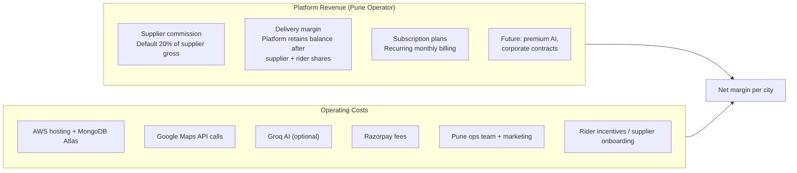

### 3.1 Unit Economics (Per Order — Platform Defaults)

| Party | Share | How platform calculates |
|-------|-------|-------------------------|
| **Supplier** | ~80% of supplier item gross (configurable per supplier) | `commissionPercentage` on Supplier model; default 20% platform cut |
| **Rider** | 10% of total order value (incl. tax) | `DELIVERY_SHARE_PERCENT = 10` in `orderPayout.js` |
| **Platform** | Remainder + commission | Credited on Razorpay/COD; debited from platform wallet on wallet-paid orders |

**Example:** Customer in Kothrud orders 2 × 20L jars @ ₹80 each = ₹160 subtotal + tax → total ₹188.  
- Rider share: ~₹19 (10%)  
- Supplier payout: ~₹128 (80% of ₹160)  
- Platform: commission ₹32 + any delivery margin after rider share  

Settlements run automatically on **delivery confirmation** via `runPayoutOnDelivered()`.

---

## 4. Platform as Pune Operations Engine

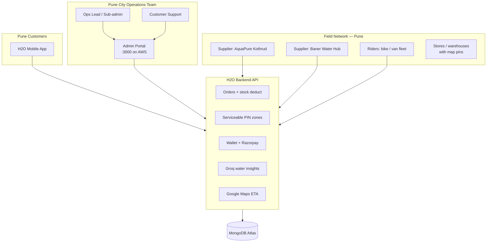

**What the admin portal manages for Pune:**

| Module | Business use in Pune |
|--------|---------------------|
| **Suppliers** | Onboard local Pune vendors; verify GST, bank, documents |
| **Stores** | Approve depot locations (Kothrud shop, Wakad warehouse) |
| **Serviceable Areas** | Map PIN codes to suppliers — control where orders are allowed |
| **Products** | City-wide catalogue oversight; ensure pricing consistency |
| **Orders** | Monitor live Pune order queue; intervene on failures |
| **Delivery Partners** | Verify riders; filter by vehicle (bike for jars, van for bulk) |
| **Subscriptions & Plans** | Family / office monthly plans for Pune societies |
| **Wallet & Financials** | Reconcile platform, supplier, rider balances |
| **Tax Settings** | Maharashtra GST configuration |
| **Support** | Handle Pune customer/supplier/rider tickets |

---

## 5. Pune Launch Strategy

### 5.1 Pre-Launch Checklist (Weeks −4 to 0)

| # | Task | Owner | Platform action |
|---|------|-------|-----------------|
| 1 | Sign 2–3 Pune water suppliers (pilot zone) | Business | Admin → Create/verify suppliers |
| 2 | Register supplier stores with GPS pins | Supplier + Admin | `POST /api/stores` → Admin approve |
| 3 | Define serviceable PINs for pilot | Ops | Admin → Serviceable Areas for 411038, 411004 |
| 4 | Load products with stock quantities | Supplier | Products with `stockQty`, `inStock` |
| 5 | Recruit 5–10 riders (bike) | Ops | Register + admin verify delivery partners |
| 6 | Configure tax (GST) and Razorpay | Finance | Admin → Tax Settings; Razorpay live keys |
| 7 | Soft launch with 50 beta households | Marketing | Invite codes; monitor `/api/admin/orders` |
| 8 | Train supplier on accept/assign flow | Ops | Supplier app: incoming orders → assign rider |

### 5.2 Phased Rollout Diagram

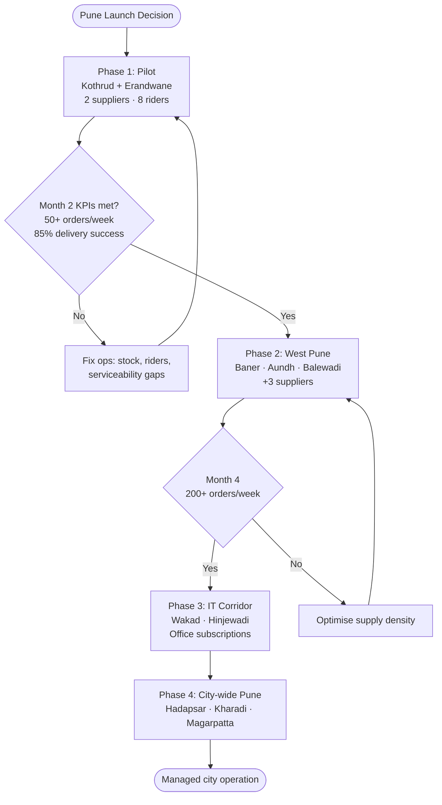

### 5.3 Launch KPIs (Pune Pilot)

| KPI | Target (Month 1) | Target (Month 6) | Where to measure |
|-----|------------------|------------------|------------------|
| Active customers | 100 | 2,000 | Admin → Users |
| Weekly orders | 50 | 800 | Admin → Orders |
| Verified suppliers | 2 | 12 | Admin → Suppliers |
| Active riders | 8 | 60 | Admin → Delivery Partners |
| Order fulfilment rate | 85% | 95% | Delivered / total orders |
| Avg delivery time | < 45 min | < 35 min | Order tracking + Maps ETA |
| Subscription conversion | 5% | 20% | Admin → Subscriptions |

---

## 6. Demand Management (Pune)

**Demand** = customer orders + subscriptions + seasonal spikes (summer, festivals, office reopenings).

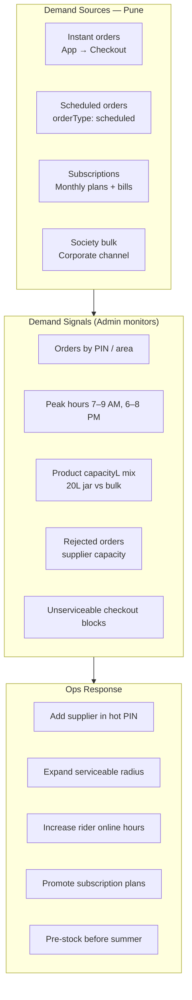

### 6.1 Managing Demand by Product Type

| Product type | Pune use case | Demand pattern | Platform handling |
|--------------|---------------|----------------|-------------------|
| 20L jar | Household daily | High morning/evening | Instant order; stock per store |
| 5L / 10L bottles | Small families | Moderate | Product catalog filters |
| Bulk / tanker | Societies, events | Sporadic high volume | `vehicleType: tanker` riders |
| Subscription plan | RWAs, offices | Predictable monthly | Plans → Subscriptions → Bills |

### 6.2 Seasonal Demand (Pune)

| Season | Demand impact | Ops playbook |
|--------|---------------|--------------|
| **Summer (Mar–Jun)** | +40–60% jar orders | Pre-load `stockQty`; add riders; extend service hours |
| **Monsoon** | Delivery delays | Increase ETA buffer; rider safety SOP |
| **Festivals (Ganesh, Diwali)** | Spike + bulk | Temporary serviceable areas; society campaigns |
| **IT campus cycles** | Hinjewadi weekday peaks | Schedule rider shifts 11 AM–2 PM, 6–9 PM |

---

## 7. Supply Management (Pune)

**Supply** = verified suppliers + approved stores + online riders + serviceable geography.

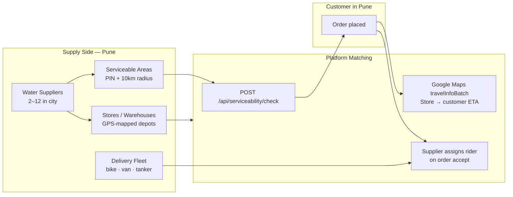

### 7.1 Supplier Onboarding (Pune Local Vendors)

| Step | Business action | Platform workflow |
|------|-----------------|-------------------|
| 1 | Identify Pune jar/tanker vendor | Field sales visit |
| 2 | Vendor registers on app | `POST /api/auth/register-supplier` |
| 3 | Submit GST, bank, license docs | Supplier onboarding screen |
| 4 | Admin verifies | Admin → Suppliers → Verify |
| 5 | Vendor adds store with map pin | `POST /api/stores` → Admin approve |
| 6 | Admin maps serviceable PINs | Serviceable Areas for vendor |
| 7 | Vendor lists products + stock | Products with `stockQty` |
| 8 | Go live in zone | Orders appear in supplier incoming queue |

**Target supplier density:** 1 supplier per 3–5 km² in pilot; avoid overlap conflicts unless intentional for competition.

### 7.2 Rider Fleet Management

| Rider type | Pune deployment | Vehicle in platform |
|------------|-----------------|----------------------|
| Jar delivery | Kothrud, Baner lanes | `bike`, `bicycle` |
| Multi-jar / office | Aundh, Viman Nagar | `van`, `miniTruck` |
| Society tanker | Peripheral Pune | `tanker` |

**Three rider onboarding paths:**

1. **Self-register** → Admin verify (city-wide gig riders)  
2. **Supplier fleet** → Supplier adds via `POST /api/supplier/delivery-partners` (instant, managed)  
3. **Supplier-as-rider** → Single-owner vendors who deliver themselves  

**Availability rules:** Rider must be approved, online, and not on another active delivery (`partnerAvailability.js`).

---

## 8. Stock & Inventory Management

The platform tracks stock at **product level per supplier/store**. Stock is **deducted at order creation** (not at delivery) — critical for Pune ops planning.

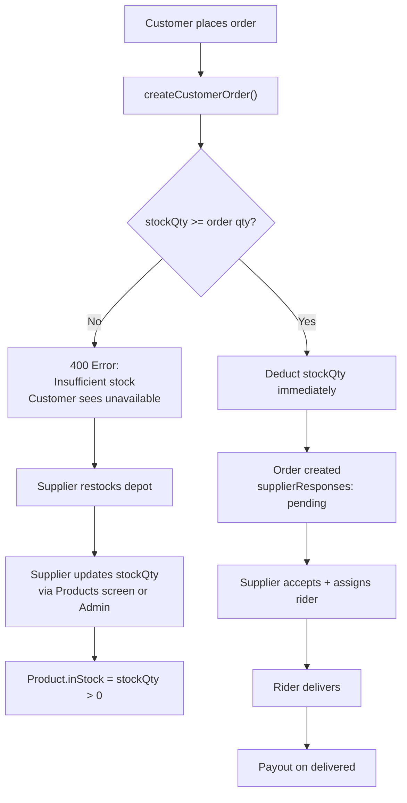

### 8.1 Stock Operations Playbook (Pune)

| Activity | Frequency | Who | How |
|----------|-----------|-----|-----|
| **Set opening stock** | Daily 6 AM | Supplier | Update `stockQty` per product per store |
| **Monitor low stock** | Continuous | Admin / Supplier | Admin → Products; filter low stock |
| **Reorder from plant** | When stock < 2 days cover | Supplier ops | Off-platform; reflect in app |
| **Multi-store allocation** | Per area | Supplier | Link products to `storeId` (Kothrud store vs Wakad warehouse) |
| **Prevent overselling** | Automatic | Platform | Server rejects order if insufficient stock |
| **Cancelled order stock** | On cancel | *Gap today* | Manual restock adjustment by supplier |

### 8.2 Stock Planning Formula (Pune Jar Business)

```
Daily stock needed (jars) = 
  (Avg daily orders × avg jars per order × 1.15 safety factor)
  + subscription scheduled deliveries
```

**Example — Kothrud depot:**

| Input | Value |
|-------|-------|
| Avg daily orders | 40 |
| Avg jars per order | 2 |
| Safety factor | 1.15 |
| **Daily stock** | 40 × 2 × 1.15 = **92 jars** |
| Opening stock target | 100 jars by 6 AM |

### 8.3 Demand–Supply Balance Workflow

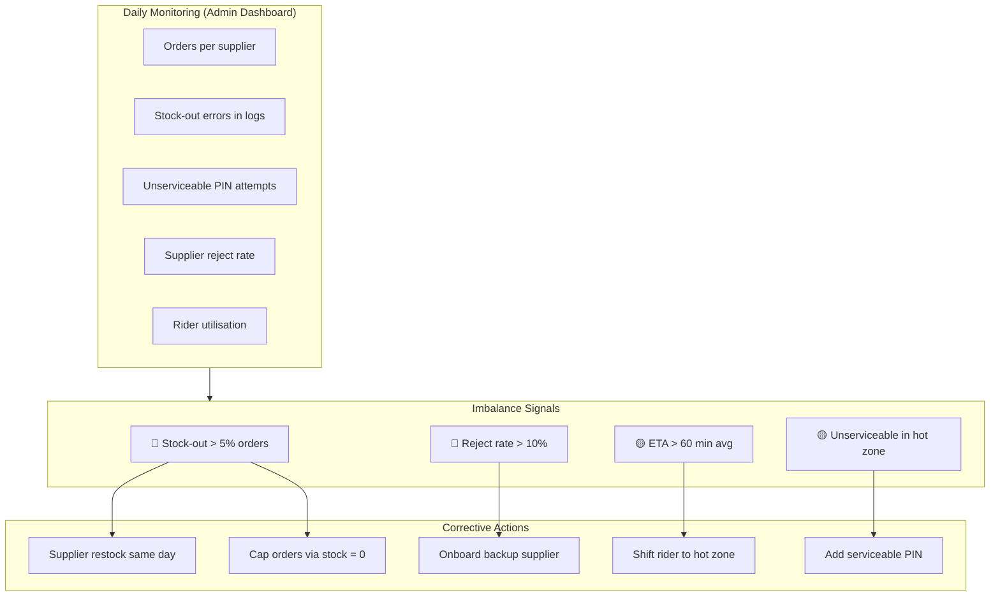

---

## 9. Order Fulfilment — Business Workflow

End-to-end business workflow connecting **Customer → Platform → Supplier → Rider → Settlement**.

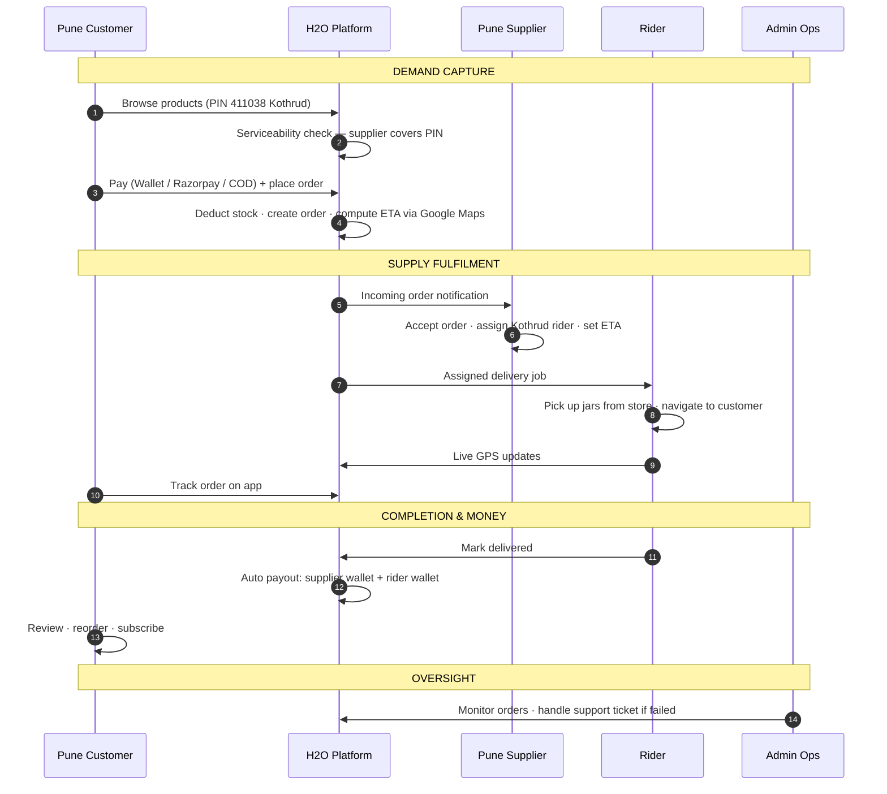

### 9.1 Order States — Business Meaning

| Platform state | Business meaning for Pune ops |
|----------------|------------------------------|
| `in_progress` + supplier `pending` | Order waiting — supplier must accept within SLA (target: 5 min) |
| `accepted` + rider assigned | Fulfillment in progress — track ETA |
| `picked_up` | Rider has stock — customer expects delivery soon |
| `delivered` | Complete — payout triggered |
| `cancelled` | Lost revenue — analyse reason (stock, rider, customer) |
| `rejected` by supplier | Supply failure — reassign zone or supplier |

### 9.2 SLA Targets (Pune Operations)

| Stage | Target SLA | Escalation |
|-------|------------|------------|
| Supplier accept | 5 minutes | Admin calls supplier |
| Rider assignment | 2 minutes after accept | Auto-suggest fleet rider |
| Pickup | 15 minutes after assign | Rider support |
| Delivery (instant) | 45 minutes total | Customer support ticket |
| Delivery (scheduled) | ±15 min of slot | SMS/app notification |

---

## 10. Admin Roles — Pune City Management

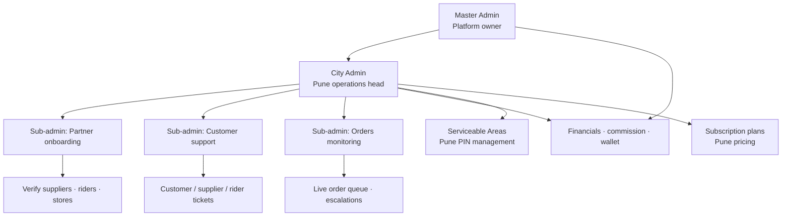

### 10.1 Daily Admin Routine (Pune Ops Center)

| Time | Activity | Admin module |
|------|----------|--------------|
| **7:00 AM** | Check overnight orders; verify rider online count | Dashboard, Orders |
| **8:00 AM** | Review supplier stock levels | Products |
| **9:00 AM–6:00 PM** | Monitor live orders; resolve support tickets | Orders, Support |
| **12:00 PM** | Peak lunch check — rider availability | Delivery Partners |
| **6:00 PM** | Evening peak prep | Orders, Serviceable Areas |
| **9:00 PM** | Day close — financials snapshot | Financials |
| **Weekly** | Verify new supplier/rider applications | Suppliers, Delivery Partners |
| **Monthly** | Subscription bill review; commission adjustment | Subscriptions, Financials |

### 10.2 Sub-admin vs Admin (Pune team structure)

| Role | Pune team example | Permissions |
|------|-------------------|-------------|
| **Master** | Founder / platform owner | Everything + master credentials |
| **Admin** | Pune city manager | Full ops including financials |
| **Sub-admin** | Support agent, onboarding exec | No financials, no delete user, no remove supplier |

---

## 11. Subscriptions & Recurring Revenue (Pune)

Subscriptions stabilise demand — critical for **society RWAs** and **office parks** in Baner/Hinjewadi.

| Step | Business action | Platform |
|------|-----------------|----------|
| 1 | Design Pune plans (Basic Family, Office 50L/day) | Admin → Plans |
| 2 | Customer selects plan on app | `GET /api/plans` |
| 3 | Customer subscribes | `POST /api/subscriptions` |
| 4 | Monthly bill generated | SubscriptionBill |
| 5 | Customer pays bill | `POST /api/bills/:id/pay` |
| 6 | Supplier/rider fulfil on schedule | Delivery partner subscription routes |

**Business benefit:** Predictable demand → suppliers pre-load stock → fewer stock-outs → higher retention.

---

## 12. Financial Management (Pune Operation)

| Flow | Description |
|------|-------------|
| **Customer pays** | Razorpay (online), Wallet (prepaid), COD (cash on delivery) |
| **Platform holds** | Razorpay settlement to platform bank account |
| **On delivery** | Auto-split to supplier wallet + rider wallet |
| **Supplier withdraws** | Off-platform bank transfer (manual today) |
| **Platform revenue** | Commission % + delivery margin; view in Admin → Financials |
| **GST** | Configured in Admin → Tax Settings (Maharashtra rates) |

**Wallet note:** For wallet-paid orders, platform wallet is debited for payouts — ops must maintain sufficient platform wallet float.

---

## 13. Risks & Challenges (Pune Specific)

### 13.1 Risk Register

| ID | Risk | Likelihood | Impact | Category |
|----|------|------------|--------|----------|
| R01 | **Stock-out during peak** (summer, morning rush) | High | High | Supply |
| R02 | **Insufficient riders** in new zone | High | High | Supply |
| R03 | **Supplier rejects orders** (capacity, offline) | Medium | High | Supply |
| R04 | **Wrong serviceability config** — customer can't order | Medium | Medium | Ops |
| R05 | **Delivery delays** — Pune traffic (Hinjewadi, JM Road) | High | Medium | Logistics |
| R06 | **Monsoon** — waterlogging, rider safety | High | Medium | Seasonal |
| R07 | **Local vendor resistance** — won't join platform | Medium | Medium | Business |
| R08 | **Price undercutting** by offline vendors | High | Medium | Competition |
| R09 | **Quality complaints** — water purity disputes | Medium | High | Trust |
| R10 | **Payment failures** — Razorpay downtime | Low | Medium | Tech |
| R11 | **Google Maps API cost** at scale | Medium | Low | Tech |
| R12 | **Regulatory** — FSSAI, local trade license | Medium | High | Compliance |
| R13 | **Multi-supplier order complexity** | Low | Medium | Platform |
| R14 | **Cancelled order stock not auto-restored** | Medium | Low | Platform gap |
| R15 | **Data/connectivity** — rider GPS gaps | Medium | Medium | Tech |

### 13.2 Challenge Deep-Dives

**Challenge 1 — Morning demand spike (7–9 AM)**  
Pune households order jars before work. If stock is updated late, first 50 customers may fail checkout.  
*Mitigation:* Mandatory 6 AM stock update SOP; admin dashboard alert if any product `stockQty < 20`.

**Challenge 2 — Geographic expansion faster than supply**  
Launching Wakad before having a Wakad depot causes unserviceable errors and bad reviews.  
*Mitigation:* Never enable PIN in Serviceable Areas until store is approved within radius.

**Challenge 3 — Supplier commission negotiation**  
Pune vendors may resist 20% commission vs WhatsApp orders at 0%.  
*Mitigation:* Phase 1 lower commission (10–15%); volume guarantee; subscription lead-sharing.

**Challenge 4 — Rider attrition**  
Gig riders switch to food delivery apps.  
*Mitigation:* Supplier-managed fleet in core zones; delivery share visibility in app; peak incentives.

**Challenge 5 — Trust in new digital brand**  
Customers prefer existing "Bhaiya" vendor.  
*Mitigation:* Verified badges; society RWA partnerships; first-order wallet credit.

---

## 14. Mitigation & Controls

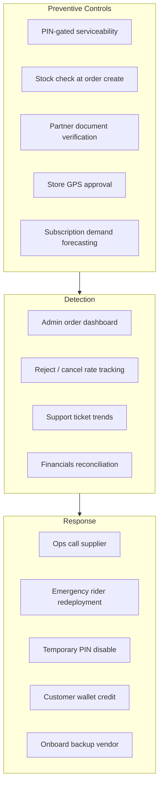

| Control | Platform feature | Pune ops action |
|---------|------------------|-----------------|
| Prevent overselling | `stockQty` deduct on order | Daily stock SOP |
| Zone control | Serviceable Areas | Don't expand PIN without supply |
| Partner quality | Admin verify suppliers/riders | Field audit before approve |
| Payment security | Razorpay HMAC verify | Use live keys in production |
| Customer recovery | Support tickets + wallet credit | Same-day resolution SLA |

---

## 15. 90-Day Pune Launch Roadmap

| Period | Focus | Key deliverables |
|--------|-------|------------------|
| **Days 1–30** | Pilot setup | 2 suppliers, 8 riders, Kothrud PINs, 100 customers, 50 orders/week |
| **Days 31–60** | Optimise ops | Stock SOP, SLA monitoring, subscription plan launch, Baner expansion |
| **Days 61–90** | Scale | Wakad/Hinjewadi, 12 suppliers, 60 riders, 800 orders/week, society partnerships |

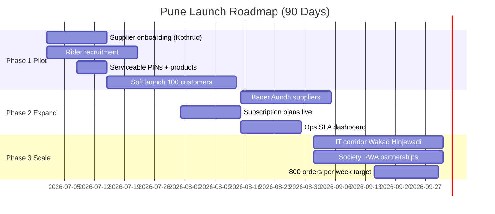

---

## 16. Complete Business Use Case Workflow

Single diagram linking **launch → daily ops → order → money → growth**.

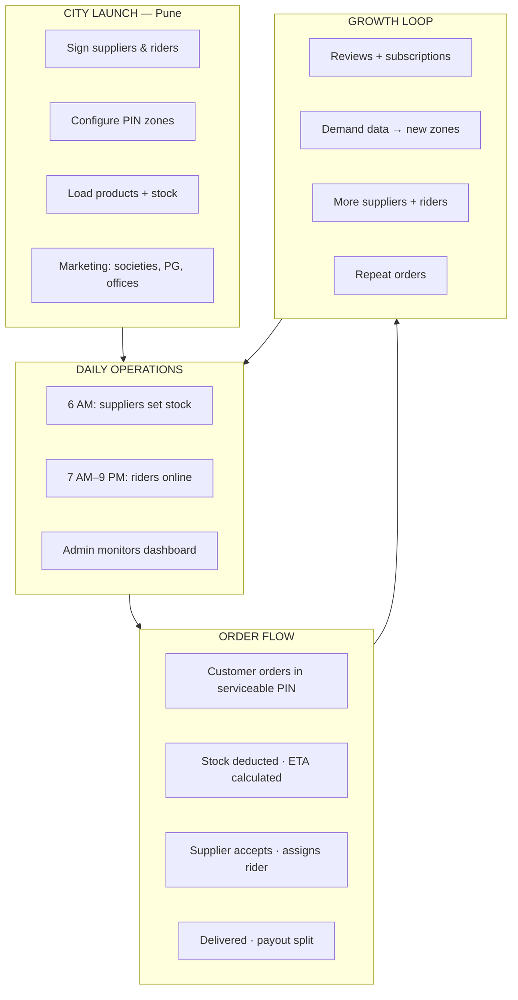

---

## 17. Success Criteria — Pune City Operation

| Dimension | 6-month success definition |
|-----------|---------------------------|
| **Market** | Top-3 digital water app in pilot zones (Kothrud, Baner, Wakad) |
| **Volume** | 800+ orders/week; 200+ active subscriptions |
| **Supply** | 12 verified suppliers; 95% fulfilment rate |
| **Unit economics** | Positive contribution margin per order after variable costs |
| **Customer** | 4.2+ avg rating; < 5% support escalation rate |
| **Platform** | 99% API uptime; stock-out rate < 3% |

---

## 18. Related Platform Documentation

| Document | Purpose |
|----------|---------|
| `docs/SYSTEM-ARCHITECTURE.md` | Technical architecture & data flows |
| `docs/H2O-System-Architecture.pdf` | Architecture PDF with diagrams |
| `docs/DEPLOYMENT-GUIDE.md` | AWS production deployment |
| `docs/requirement-capture.md` | Full functional requirements |
| `config/aws-production.json` | Production API URLs |

---

*This business use case is aligned with H2O Online platform capabilities as implemented in the codebase: stock deduction on order, serviceable PIN areas, supplier/rider verification, commission-based payouts, subscriptions, and admin portal operations.*
