# H2O Online — System Architecture & User Journey Documentation

**Version:** 1.0  
**Last updated:** June 2026  
**Production API:** `http://13.62.57.255:5000`  
**Production Admin:** `http://13.62.57.255:3000`  
**Database:** MongoDB Atlas (`H20online`)

This document describes the end-to-end architecture, third-party integrations, data flows (address, order, auth), and user journeys across all actors: **Customer**, **Supplier**, **Delivery Partner (Rider)**, **Society**, and **Admin**.

---

## Table of Contents

1. [System Overview](#1-system-overview)
2. [End-to-End Architecture Diagram](#2-end-to-end-architecture-diagram)
3. [Deployment Architecture (AWS)](#3-deployment-architecture-aws)
4. [Third-Party Integrations](#4-third-party-integrations)
5. [Authentication & Authorization](#5-authentication--authorization)
6. [Address & Serviceability Data Flow](#6-address--serviceability-data-flow)
7. [Order Lifecycle — Cross-Actor Flow](#7-order-lifecycle--cross-actor-flow)
8. [Payment Data Flow (Razorpay)](#8-payment-data-flow-razorpay)
9. [AI (Groq) Data Flow](#9-ai-groq-data-flow)
10. [Supplier Onboarding Journey](#10-supplier-onboarding-journey)
11. [Rider / Delivery Partner Journey](#11-rider--delivery-partner-journey)
12. [Store Management Journey](#12-store-management-journey)
13. [Admin Portal Roles & Capabilities](#13-admin-portal-roles--capabilities)
14. [Sample Customer User Journey](#14-sample-customer-user-journey)
15. [Multi-Actor Order Fulfillment Journey](#15-multi-actor-order-fulfillment-journey)
16. [Key API Reference by Actor](#16-key-api-reference-by-actor)
17. [Data Models (Core Entities)](#17-data-models-core-entities)

---

## 1. System Overview

H2O Online is a water delivery platform with three client applications and one shared backend:

| Layer | Technology | Folder | Purpose |
|-------|-----------|--------|---------|
| **Mobile App** | Expo / React Native | `mobile/` | Customer ordering, supplier ops, rider delivery, society accounts |
| **Admin Portal** | Vite / React SPA | `admin/` | Platform management, approvals, financials, support |
| **Backend API** | Node.js / Express | `backend/` | REST API, business logic, third-party orchestration |
| **Database** | MongoDB Atlas | Cloud | Persistent storage for all entities |
| **Infrastructure** | AWS EC2 (Ubuntu) | `config/aws-production.json` | Hosts API (:5000) and Admin SPA (:3000) via PM2 |

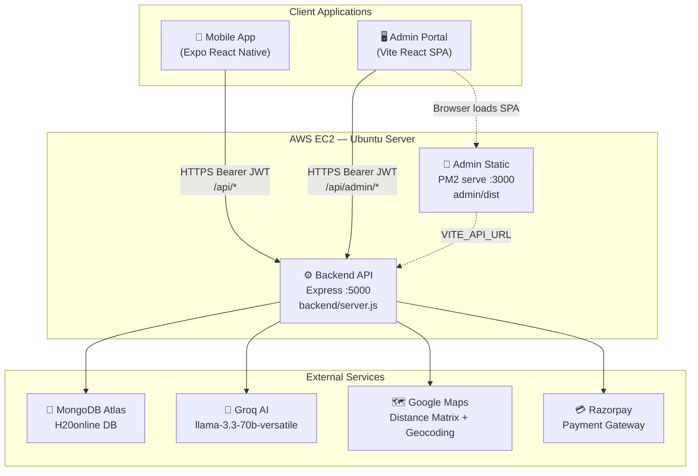
```mermaid
flowchart TB
  subgraph Clients["Client Applications"]
    Mobile["📱 Mobile App<br/>(Expo React Native)"]
    Admin["🖥️ Admin Portal<br/>(Vite React SPA)"]
  end

  subgraph AWS["AWS EC2 — Ubuntu Server"]
    API["⚙️ Backend API<br/>Express :5000<br/>backend/server.js"]
    AdminStatic["📄 Admin Static<br/>PM2 serve :3000<br/>admin/dist"]
  end

  subgraph External["External Services"]
    Atlas["🍃 MongoDB Atlas<br/>H20online DB"]
    Groq["🤖 Groq AI<br/>llama-3.3-70b-versatile"]
    GMaps["🗺️ Google Maps<br/>Distance Matrix + Geocoding"]
    Razorpay["💳 Razorpay<br/>Payment Gateway"]
  end

  Mobile -->|"HTTPS Bearer JWT<br/>/api/*"| API
  Admin -->|"HTTPS Bearer JWT<br/>/api/admin/*"| API
  Admin -.->|"Browser loads SPA"| AdminStatic
  AdminStatic -.->|"VITE_API_URL"| API

  API --> Atlas
  API --> Groq
  API --> GMaps
  API --> Razorpay
```

---

## 2. End-to-End Architecture Diagram

### 2.1 Logical Component Architecture

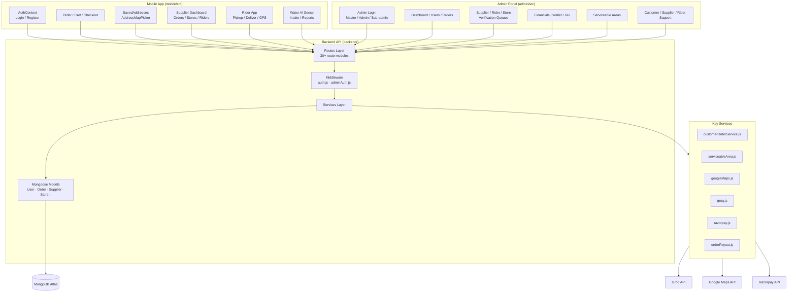
```mermaid
flowchart TB
  subgraph MobileApp["Mobile App (mobile/src)"]
    MAuth["AuthContext<br/>Login / Register"]
    MOrder["Order / Cart / Checkout"]
    MAddr["SavedAddresses<br/>AddressMapPicker"]
    MSupplier["Supplier Dashboard<br/>Orders / Stores / Riders"]
    MRider["Rider App<br/>Pickup / Deliver / GPS"]
    MAi["Water AI Sense<br/>Intake / Reports"]
  end

  subgraph AdminPortal["Admin Portal (admin/src)"]
    AAuth["Admin Login<br/>Master / Admin / Sub-admin"]
    ADash["Dashboard / Users / Orders"]
    AApprove["Supplier / Rider / Store<br/>Verification Queues"]
    AFinance["Financials / Wallet / Tax"]
    AAreas["Serviceable Areas"]
    ASupport["Customer / Supplier / Rider Support"]
  end

  subgraph Backend["Backend API (backend/)"]
    direction TB
    Routes["Routes Layer<br/>30+ route modules"]
    Middleware["Middleware<br/>auth.js · adminAuth.js"]
    Services["Services Layer"]
    Models["Mongoose Models<br/>User · Order · Supplier · Store..."]
  end

  subgraph ServicesDetail["Key Services"]
    COS["customerOrderService.js"]
    SA["serviceableArea.js"]
    GM["googleMaps.js"]
    GR["groq.js"]
    RZ["razorpay.js"]
    OP["orderPayout.js"]
  end

  MAuth --> Routes
  MOrder --> Routes
  MAddr --> Routes
  MSupplier --> Routes
  MRider --> Routes
  MAi --> Routes

  AAuth --> Routes
  ADash --> Routes
  AApprove --> Routes
  AFinance --> Routes
  AAreas --> Routes
  ASupport --> Routes

  Routes --> Middleware
  Middleware --> Services
  Services --> ServicesDetail
  Services --> Models
  Models --> Atlas[("MongoDB Atlas")]
  ServicesDetail --> GroqExt["Groq API"]
  ServicesDetail --> GMapsExt["Google Maps API"]
  ServicesDetail --> RazorpayExt["Razorpay API"]
```

### 2.2 Request Flow (Generic)

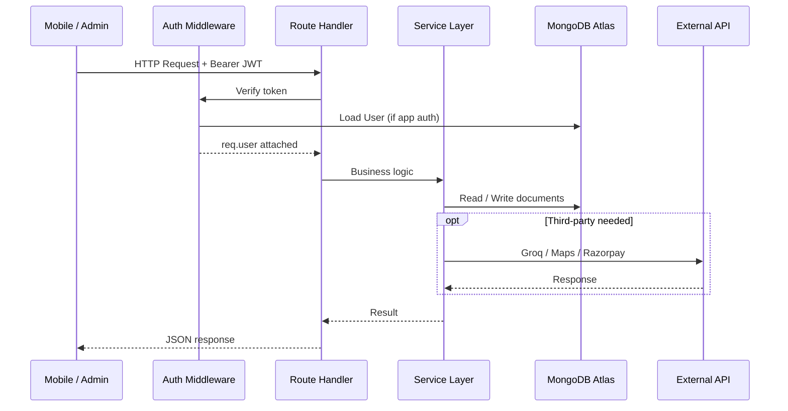
```mermaid
sequenceDiagram
  participant Client as Mobile / Admin
  participant MW as Auth Middleware
  participant Route as Route Handler
  participant Svc as Service Layer
  participant DB as MongoDB Atlas
  participant Ext as External API

  Client->>Route: HTTP Request + Bearer JWT
  Route->>MW: Verify token
  MW->>DB: Load User (if app auth)
  MW-->>Route: req.user attached
  Route->>Svc: Business logic
  Svc->>DB: Read / Write documents
  opt Third-party needed
    Svc->>Ext: Groq / Maps / Razorpay
    Ext-->>Svc: Response
  end
  Svc-->>Route: Result
  Route-->>Client: JSON response
```

---

## 3. Deployment Architecture (AWS)

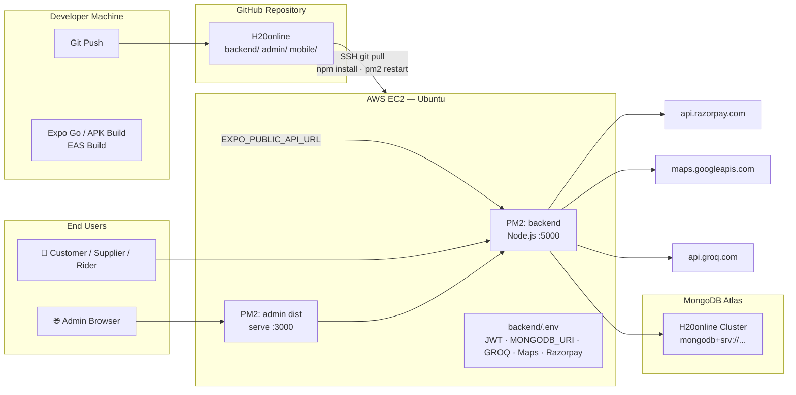
```mermaid
flowchart LR
  subgraph Dev["Developer Machine"]
    Git["Git Push"]
    Expo["Expo Go / APK Build<br/>EAS Build"]
  end

  subgraph GitHub["GitHub Repository"]
    Repo["H20online<br/>backend/ admin/ mobile/"]
  end

  subgraph EC2["AWS EC2 — Ubuntu"]
    PM2API["PM2: backend<br/>Node.js :5000"]
    PM2Admin["PM2: admin dist<br/>serve :3000"]
    Env["backend/.env<br/>JWT · MONGODB_URI · GROQ · Maps · Razorpay"]
  end

  subgraph Atlas["MongoDB Atlas"]
    Cluster["H20online Cluster<br/>mongodb+srv://..."]
  end

  subgraph Users["End Users"]
    Phone["📱 Customer / Supplier / Rider"]
    Browser["🌐 Admin Browser"]
  end

  Git --> Repo
  Repo -->|"SSH git pull<br/>npm install · pm2 restart"| EC2
  Expo -->|"EXPO_PUBLIC_API_URL"| PM2API
  Phone --> PM2API
  Browser --> PM2Admin
  PM2Admin --> PM2API
  PM2API --> Cluster
  PM2API --> GroqCloud["api.groq.com"]
  PM2API --> GoogleCloud["maps.googleapis.com"]
  PM2API --> RazorpayCloud["api.razorpay.com"]
```

### Production Configuration

| Component | Config File | Key Variables |
|-----------|-------------|---------------|
| Backend | `backend/.env` | `MONGODB_URI`, `JWT_SECRET`, `GROQ_API_KEY`, `GOOGLE_MAPS_API_KEY`, `RAZORPAY_KEY_ID/SECRET`, `CORS_ORIGINS` |
| Admin | `admin/.env` | `VITE_API_URL=http://13.62.57.255:5000` |
| Mobile | `mobile/.env` / `eas.json` | `EXPO_PUBLIC_API_URL`, `EXPO_PUBLIC_GOOGLE_MAPS_API_KEY`, `EXPO_PUBLIC_RAZORPAY_KEY_ID` |
| AWS URLs | `config/aws-production.json` | Single source of truth for EC2 IP and ports |

**Security Group ports:** 22 (SSH), 5000 (API), 3000 (Admin), 80/443 (optional reverse proxy).

---

## 4. Third-Party Integrations

| Integration | Provider | Config (Backend) | Config (Mobile) | Used For | Backend Files |
|-------------|----------|------------------|-----------------|----------|---------------|
| **Database** | MongoDB Atlas | `MONGODB_URI` | — | All persistence | `config/db.js`, `config/mongo.js` |
| **AI** | Groq | `GROQ_API_KEY`, `GROQ_MODEL` | — | Water insights, intake tips, reports, Q&A | `services/groq.js`, `routes/ai.js`, `services/waterAiContext.js` |
| **Maps (server)** | Google Maps | `GOOGLE_MAPS_API_KEY` | — | Distance Matrix (ETA), Geocoding (PIN→coords) | `services/googleMaps.js`, `services/serviceableArea.js`, `routes/maps.js` |
| **Maps (client)** | Google Maps | — | `EXPO_PUBLIC_GOOGLE_MAPS_API_KEY` | Map picker, reverse geocode, device location | `mobile/src/components/AddressMapPicker.native.js`, `utils/googleMaps.js` |
| **Payments** | Razorpay | `RAZORPAY_KEY_ID`, `RAZORPAY_KEY_SECRET` | `EXPO_PUBLIC_RAZORPAY_KEY_ID` | Online payment → order creation | `services/razorpay.js`, `routes/payments.js` |
| **Hosting** | AWS EC2 | Server `.env` | `EXPO_PUBLIC_API_URL` | Production API + Admin hosting | `docs/DEPLOYMENT-GUIDE.md`, PM2 |

### Groq AI Endpoints

| Endpoint | Method | Purpose |
|----------|--------|---------|
| `/api/ai/water-insight` | GET | Personalized hydration insight on dashboard |
| `/api/ai/intake-sense?date=` | GET | Daily intake analysis |
| `/api/ai/water-report` | POST | Generate health/hydration report |
| `/api/ai/ask` | POST | Natural language Q&A about water/health |

Fallback responses are returned when `GROQ_API_KEY` is missing or the API fails (`services/groq.js`).

### Google Maps Endpoints

| Endpoint | Method | Purpose |
|----------|--------|---------|
| `/api/maps/travel` | POST | Batch distance/duration from store → customer |
| `/api/serviceability/check` | POST | PIN/radius serviceability (uses geocoding internally) |

---

## 5. Authentication & Authorization

### 5.1 Mobile App Authentication (JWT)

All mobile users authenticate via `POST /api/auth/*` and receive a **7-day JWT** (`{ userId }`).

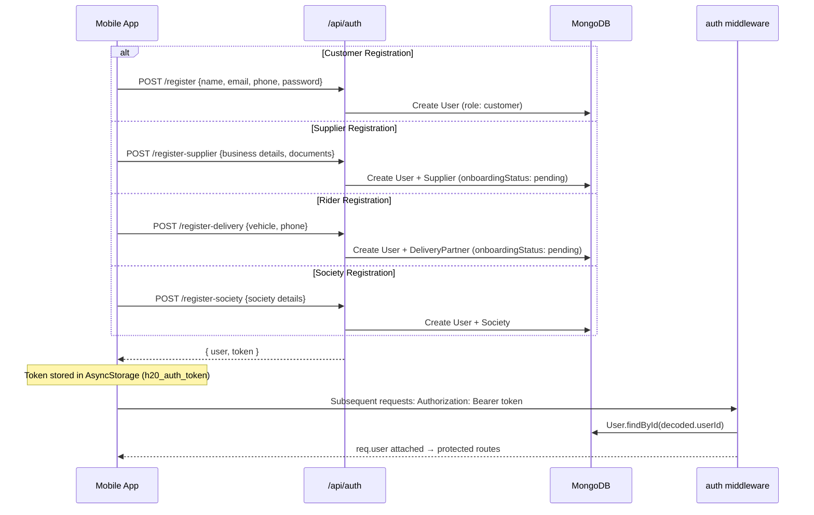
```mermaid
sequenceDiagram
  participant App as Mobile App
  participant Auth as /api/auth
  participant DB as MongoDB
  participant MW as auth middleware

  alt Customer Registration
    App->>Auth: POST /register {name, email, phone, password}
    Auth->>DB: Create User (role: customer)
  else Supplier Registration
    App->>Auth: POST /register-supplier {business details, documents}
    Auth->>DB: Create User + Supplier (onboardingStatus: pending)
  else Rider Registration
    App->>Auth: POST /register-delivery {vehicle, phone}
    Auth->>DB: Create User + DeliveryPartner (onboardingStatus: pending)
  else Society Registration
    App->>Auth: POST /register-society {society details}
    Auth->>DB: Create User + Society
  end

  Auth-->>App: { user, token }

  Note over App: Token stored in AsyncStorage (h20_auth_token)

  App->>MW: Subsequent requests: Authorization: Bearer token
  MW->>DB: User.findById(decoded.userId)
  MW-->>App: req.user attached → protected routes
```

### 5.2 Mobile User Roles

| Role | Registration | Default Status | Mobile Screens After Login |
|------|-------------|----------------|---------------------------|
| **customer** | `POST /api/auth/register` | Active | Dashboard, Order, Checkout, Tracking |
| **supplier** | `POST /api/auth/register-supplier` | Pending until admin verify | Verification pending → Supplier dashboard |
| **deliveryPartner** | `POST /api/auth/register-delivery` | Pending until admin verify | Verification pending → Rider dashboard |
| **society** | `POST /api/auth/register-society` | Active | Society product catalog & orders |

**Session restore:** App reads token from AsyncStorage → `GET /api/users/me` on startup (`mobile/src/context/AuthContext.js`).

**Routing logic:** `mobile/src/utils/authRouting.js` redirects suppliers/riders with `onboardingStatus !== "approved"` to verification-pending screens.

### 5.3 Admin Portal Authentication

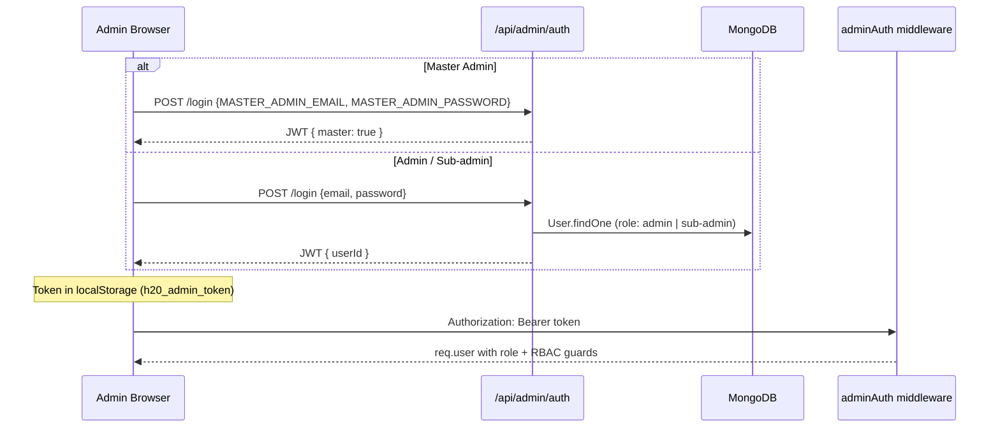
```mermaid
sequenceDiagram
  participant Browser as Admin Browser
  participant Auth as /api/admin/auth
  participant DB as MongoDB
  participant MW as adminAuth middleware

  alt Master Admin
    Browser->>Auth: POST /login {MASTER_ADMIN_EMAIL, MASTER_ADMIN_PASSWORD}
    Auth-->>Browser: JWT { master: true }
  else Admin / Sub-admin
    Browser->>Auth: POST /login {email, password}
    Auth->>DB: User.findOne (role: admin | sub-admin)
    Auth-->>Browser: JWT { userId }
  end

  Note over Browser: Token in localStorage (h20_admin_token)

  Browser->>MW: Authorization: Bearer token
  MW-->>Browser: req.user with role + RBAC guards
```

### 5.4 Admin Role Permissions (RBAC)

| Capability | Master | Admin | Sub-admin |
|------------|:------:|:-----:|:---------:|
| Dashboard, Users, Orders (view) | ✅ | ✅ | ✅ |
| Supplier / Rider / Store verify | ✅ | ✅ | ✅ |
| Products, Plans, Subscriptions | ✅ | ✅ | ✅ |
| Serviceable Areas | ✅ | ✅ | ✅ |
| Support tickets (all types) | ✅ | ✅ | ✅ |
| Surveys | ✅ | ✅ | ✅ |
| **Financials** | ✅ | ✅ | ❌ |
| **Delete user** | ✅ | ✅ | ❌ |
| **Remove supplier** | ✅ | ✅ | ❌ |
| **Create admin users** | ✅ | ✅ | ❌ |
| Change master credentials | ✅ | ❌ | ❌ |

Guards implemented in `backend/middleware/adminAuth.js`: `requireCanSeeFinancials`, `requireCanDeleteUser`, `requireCanRemoveSupplier`, `requireCanCreateAdmin`.

---

## 6. Address & Serviceability Data Flow

Addresses and serviceability are checked at **three layers**: map picker (client), checkout (client + API), and order creation (server — authoritative).

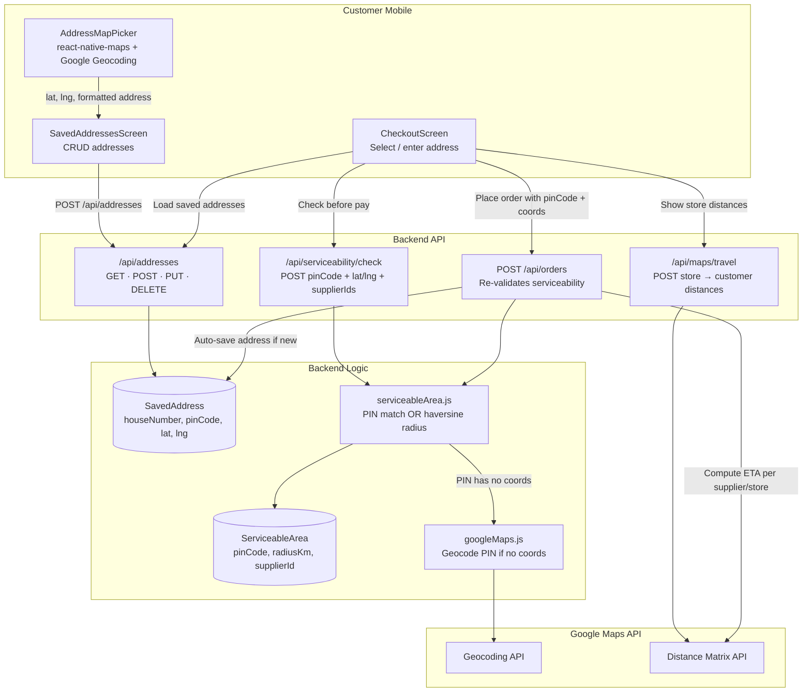
```mermaid
flowchart TB
  subgraph CustomerMobile["Customer Mobile"]
    MapPicker["AddressMapPicker<br/>react-native-maps + Google Geocoding"]
    SavedAddr["SavedAddressesScreen<br/>CRUD addresses"]
    Checkout["CheckoutScreen<br/>Select / enter address"]
  end

  subgraph BackendAPI["Backend API"]
    AddrAPI["/api/addresses<br/>GET · POST · PUT · DELETE"]
    SvcAPI["/api/serviceability/check<br/>POST pinCode + lat/lng + supplierIds"]
    MapsAPI["/api/maps/travel<br/>POST store → customer distances"]
    OrderAPI["POST /api/orders<br/>Re-validates serviceability"]
  end

  subgraph BackendLogic["Backend Logic"]
    SavedModel[("SavedAddress<br/>houseNumber, pinCode, lat, lng")]
    SvcModel[("ServiceableArea<br/>pinCode, radiusKm, supplierId")]
    SvcSvc["serviceableArea.js<br/>PIN match OR haversine radius"]
    GeoSvc["googleMaps.js<br/>Geocode PIN if no coords"]
  end

  subgraph Google["Google Maps API"]
    Geocode["Geocoding API"]
    Matrix["Distance Matrix API"]
  end

  MapPicker -->|"lat, lng, formatted address"| SavedAddr
  SavedAddr -->|"POST /api/addresses"| AddrAPI
  AddrAPI --> SavedModel

  Checkout -->|"Load saved addresses"| AddrAPI
  Checkout -->|"Check before pay"| SvcAPI
  SvcAPI --> SvcSvc
  SvcSvc --> SvcModel
  SvcSvc -->|"PIN has no coords"| GeoSvc
  GeoSvc --> Geocode

  Checkout -->|"Show store distances"| MapsAPI
  MapsAPI --> Matrix

  Checkout -->|"Place order with pinCode + coords"| OrderAPI
  OrderAPI --> SvcSvc
  OrderAPI -->|"Compute ETA per supplier/store"| Matrix
  OrderAPI -->|"Auto-save address if new"| SavedModel
```

### Serviceability Rules

1. Admin defines **ServiceableArea** per supplier: PIN code + optional lat/lng + radius (default 10 km).
2. `checkServiceability()` matches if:
   - Exact **6-digit PIN** matches, **OR**
   - Customer coordinates fall within **haversine radius** of supplier area center.
3. If PIN has no coordinates, backend **geocodes** via Google Maps.
4. Checkout calls `POST /api/serviceability/check` — blocks order if unserviceable.
5. `createCustomerOrder()` **re-checks server-side** (client check is not trusted alone).

### Address Fields (SavedAddress model)

| Field | Required | Used In |
|-------|----------|---------|
| houseNumber, locality, city, state | Yes | Display, order delivery |
| pinCode (6-digit) | Yes | Serviceability |
| phoneNumber | Yes | Delivery contact |
| latitude, longitude | Optional (from map picker) | Radius serviceability, travel ETA |
| isDefault | Optional | Checkout pre-selection |

---

## 7. Order Lifecycle — Cross-Actor Flow

### 7.1 Order State Machine

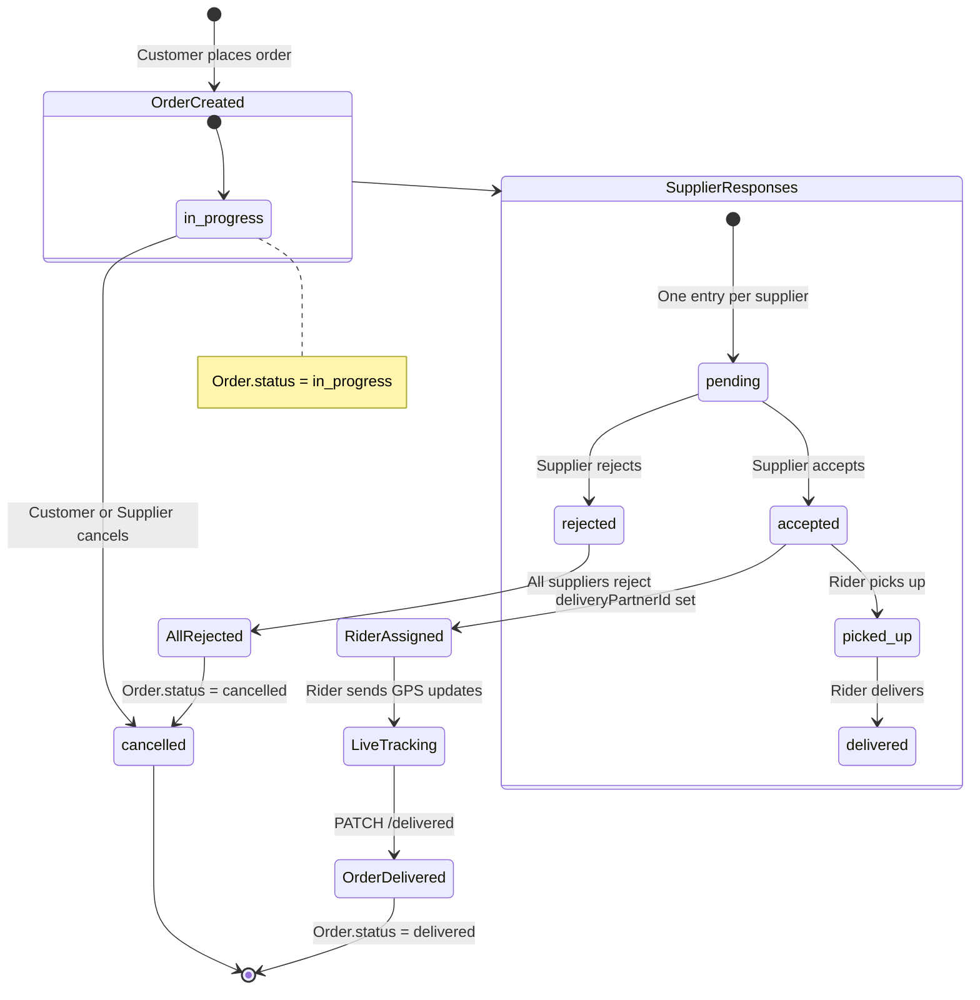
```mermaid
stateDiagram-v2
  [*] --> OrderCreated: Customer places order

  state OrderCreated {
    [*] --> in_progress
    note right of in_progress: Order.status = in_progress
  }

  state SupplierResponses {
    [*] --> pending: One entry per supplier
    pending --> accepted: Supplier accepts
    pending --> rejected: Supplier rejects
    accepted --> picked_up: Rider picks up
    picked_up --> delivered: Rider delivers
  }

  OrderCreated --> SupplierResponses

  rejected --> AllRejected: All suppliers reject
  AllRejected --> cancelled: Order.status = cancelled

  accepted --> RiderAssigned: deliveryPartnerId set
  RiderAssigned --> LiveTracking: Rider sends GPS updates
  LiveTracking --> OrderDelivered: PATCH /delivered

  OrderDelivered --> [*]: Order.status = delivered
  cancelled --> [*]

  in_progress --> cancelled: Customer or Supplier cancels
```

### 7.2 Order Status Fields

| Field | Values | Actor |
|-------|--------|-------|
| `Order.status` | `in_progress` → `delivered` \| `cancelled` | System |
| `supplierResponses[].status` | `pending` → `accepted` \| `rejected` | Supplier |
| `supplierResponses[].deliveryStage` | `accepted` → `picked_up` → `delivered` | Rider |
| `paymentStatus` | `pending` \| `paid` \| `failed` | Payment gateway |

### 7.3 End-to-End Order Sequence (All Actors)

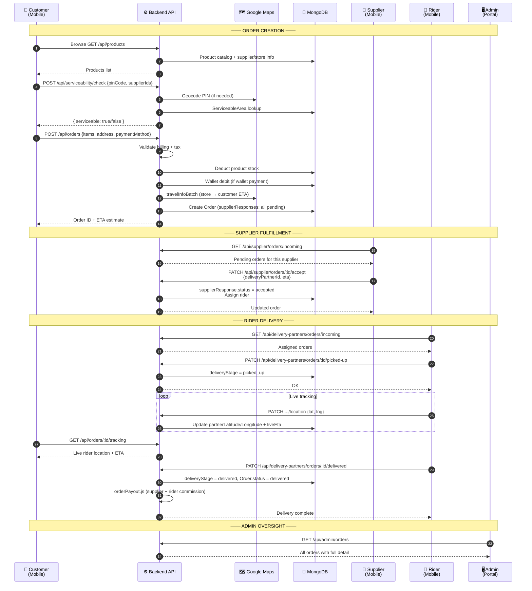
```mermaid
sequenceDiagram
  autonumber
  participant C as 👤 Customer<br/>(Mobile)
  participant API as ⚙️ Backend API
  participant GMaps as 🗺️ Google Maps
  participant DB as 🍃 MongoDB
  participant S as 🏪 Supplier<br/>(Mobile)
  participant R as 🛵 Rider<br/>(Mobile)
  participant A as 🖥️ Admin<br/>(Portal)

  Note over C,A: ─── ORDER CREATION ───

  C->>API: Browse GET /api/products
  API->>DB: Product catalog + supplier/store info
  API-->>C: Products list

  C->>API: POST /api/serviceability/check {pinCode, supplierIds}
  API->>GMaps: Geocode PIN (if needed)
  API->>DB: ServiceableArea lookup
  API-->>C: { serviceable: true/false }

  C->>API: POST /api/orders {items, address, paymentMethod}
  API->>API: Validate billing + tax
  API->>DB: Deduct product stock
  API->>DB: Wallet debit (if wallet payment)
  API->>GMaps: travelInfoBatch (store → customer ETA)
  API->>DB: Create Order (supplierResponses: all pending)
  API-->>C: Order ID + ETA estimate

  Note over C,A: ─── SUPPLIER FULFILLMENT ───

  S->>API: GET /api/supplier/orders/incoming
  API-->>S: Pending orders for this supplier

  S->>API: PATCH /api/supplier/orders/:id/accept<br/>{deliveryPartnerId, eta}
  API->>DB: supplierResponse.status = accepted<br/>Assign rider
  API-->>S: Updated order

  Note over C,A: ─── RIDER DELIVERY ───

  R->>API: GET /api/delivery-partners/orders/incoming
  API-->>R: Assigned orders

  R->>API: PATCH /api/delivery-partners/orders/:id/picked-up
  API->>DB: deliveryStage = picked_up
  API-->>R: OK

  loop Live tracking
    R->>API: PATCH .../location {lat, lng}
    API->>DB: Update partnerLatitude/Longitude + liveEta
  end

  C->>API: GET /api/orders/:id/tracking
  API-->>C: Live rider location + ETA

  R->>API: PATCH /api/delivery-partners/orders/:id/delivered
  API->>DB: deliveryStage = delivered, Order.status = delivered
  API->>API: orderPayout.js (supplier + rider commission)
  API-->>R: Delivery complete

  Note over C,A: ─── ADMIN OVERSIGHT ───

  A->>API: GET /api/admin/orders
  API-->>A: All orders with full detail
```

### 7.4 Order Creation Internals (`customerOrderService.js`)

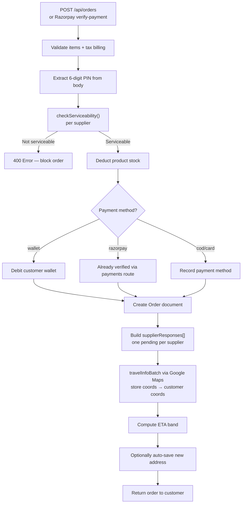
```mermaid
flowchart TD
  A["POST /api/orders<br/>or Razorpay verify-payment"] --> B["Validate items + tax billing"]
  B --> C["Extract 6-digit PIN from body"]
  C --> D["checkServiceability()<br/>per supplier"]
  D -->|Not serviceable| E["400 Error — block order"]
  D -->|Serviceable| F["Deduct product stock"]
  F --> G{"Payment method?"}
  G -->|wallet| H["Debit customer wallet"]
  G -->|razorpay| I["Already verified via payments route"]
  G -->|cod/card| J["Record payment method"]
  H --> K["Create Order document"]
  I --> K
  J --> K
  K --> L["Build supplierResponses[]<br/>one pending per supplier"]
  L --> M["travelInfoBatch via Google Maps<br/>store coords → customer coords"]
  M --> N["Compute ETA band"]
  N --> O["Optionally auto-save new address"]
  O --> P["Return order to customer"]
```

---

## 8. Payment Data Flow (Razorpay)

Direct `POST /api/orders` with `paymentMethod: "razorpay"` is **rejected** — payment must go through the verify flow.

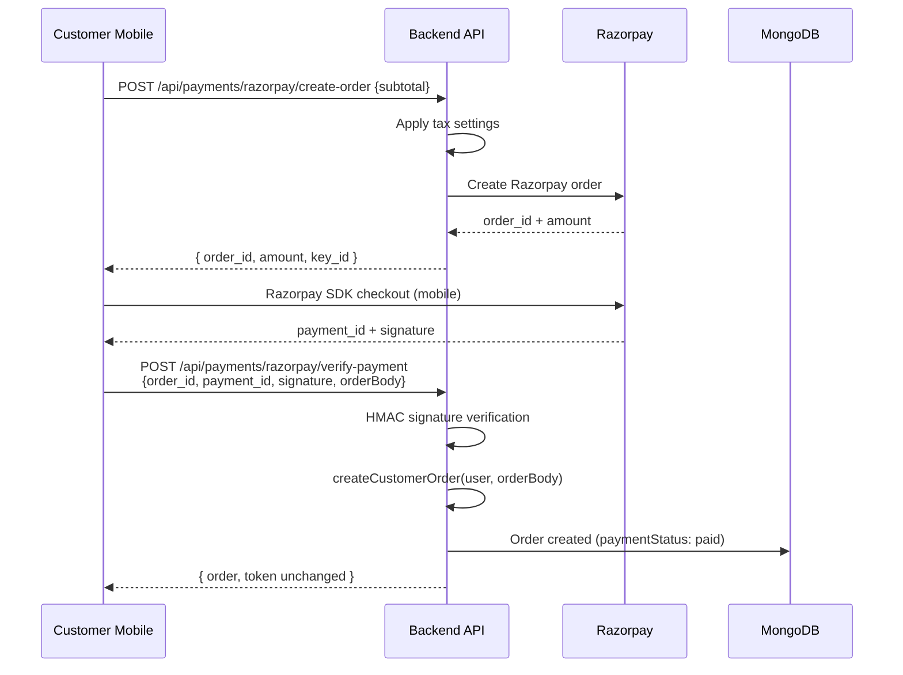
```mermaid
sequenceDiagram
  participant C as Customer Mobile
  participant API as Backend API
  participant RZ as Razorpay
  participant DB as MongoDB

  C->>API: POST /api/payments/razorpay/create-order {subtotal}
  API->>API: Apply tax settings
  API->>RZ: Create Razorpay order
  RZ-->>API: order_id + amount
  API-->>C: { order_id, amount, key_id }

  C->>RZ: Razorpay SDK checkout (mobile)
  RZ-->>C: payment_id + signature

  C->>API: POST /api/payments/razorpay/verify-payment<br/>{order_id, payment_id, signature, orderBody}
  API->>API: HMAC signature verification
  API->>API: createCustomerOrder(user, orderBody)
  API->>DB: Order created (paymentStatus: paid)
  API-->>C: { order, token unchanged }
```

**Other payment methods:** `wallet` (debit on create), `cod`, `card` (direct order create).

---

## 9. AI (Groq) Data Flow

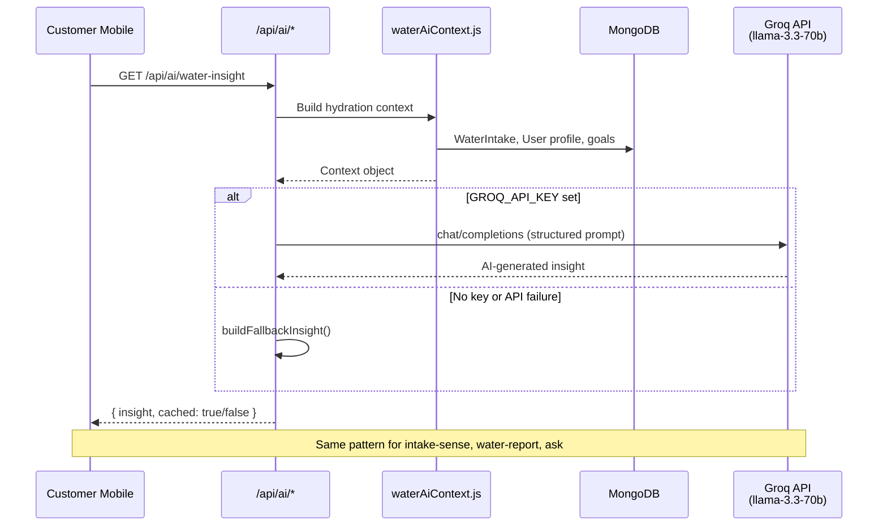
```mermaid
sequenceDiagram
  participant C as Customer Mobile
  participant API as /api/ai/*
  participant Ctx as waterAiContext.js
  participant DB as MongoDB
  participant Groq as Groq API<br/>(llama-3.3-70b)

  C->>API: GET /api/ai/water-insight
  API->>Ctx: Build hydration context
  Ctx->>DB: WaterIntake, User profile, goals
  Ctx-->>API: Context object

  alt GROQ_API_KEY set
    API->>Groq: chat/completions (structured prompt)
    Groq-->>API: AI-generated insight
  else No key or API failure
    API->>API: buildFallbackInsight()
  end

  API-->>C: { insight, cached: true/false }

  Note over C,Groq: Same pattern for intake-sense, water-report, ask
```

**Caching:** 15-minute in-memory cache per user per insight type (`services/groq.js`).

---

## 10. Supplier Onboarding Journey

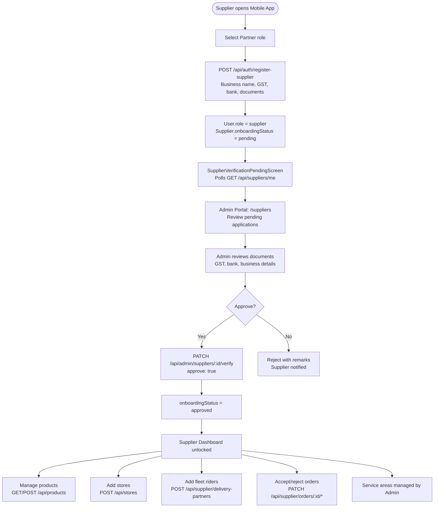
```mermaid
flowchart TD
  Start(["Supplier opens Mobile App"]) --> Role["Select Partner role"]
  Role --> Reg["POST /api/auth/register-supplier<br/>Business name, GST, bank, documents"]
  Reg --> Pending["User.role = supplier<br/>Supplier.onboardingStatus = pending"]
  Pending --> WaitScreen["SupplierVerificationPendingScreen<br/>Polls GET /api/suppliers/me"]

  WaitScreen --> AdminQueue["Admin Portal: /suppliers<br/>Review pending applications"]
  AdminQueue --> Review["Admin reviews documents<br/>GST, bank, business details"]
  Review --> Decision{Approve?}

  Decision -->|Yes| Approve["PATCH /api/admin/suppliers/:id/verify<br/>approve: true"]
  Decision -->|No| Reject["Reject with remarks<br/>Supplier notified"]

  Approve --> Approved["onboardingStatus = approved"]
  Approved --> Dashboard["Supplier Dashboard unlocked"]
  Dashboard --> Products["Manage products<br/>GET/POST /api/products"]
  Dashboard --> Stores["Add stores<br/>POST /api/stores"]
  Dashboard --> Riders["Add fleet riders<br/>POST /api/supplier/delivery-partners"]
  Dashboard --> Orders["Accept/reject orders<br/>PATCH /api/supplier/orders/:id/*"]
  Dashboard --> Areas["Service areas managed by Admin"]
```

### Supplier Registration Data

| Field | Stored In | Verified By |
|-------|-----------|-------------|
| Business name, contact | `Supplier` | Admin |
| GST number | `Supplier` | Admin |
| Bank details | `Supplier` | Admin |
| Document URLs (license, etc.) | `Supplier.documents` | Admin |
| Business address + lat/lng | `Supplier` | Admin / self-update via PATCH /api/suppliers/me |

---

## 11. Rider / Delivery Partner Journey

Riders can join the platform through **three paths**:

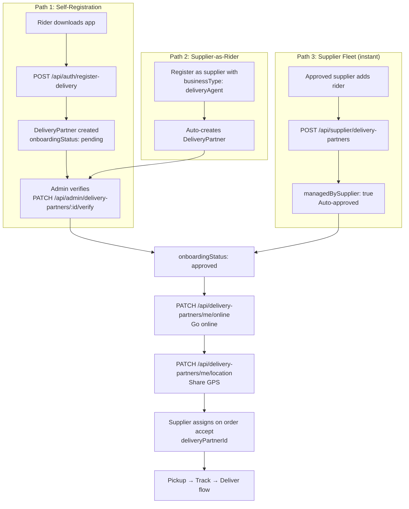
```mermaid
flowchart TB
  subgraph Path1["Path 1: Self-Registration"]
    R1["Rider downloads app"] --> R2["POST /api/auth/register-delivery"]
    R2 --> R3["DeliveryPartner created<br/>onboardingStatus: pending"]
    R3 --> R4["Admin verifies<br/>PATCH /api/admin/delivery-partners/:id/verify"]
  end

  subgraph Path2["Path 2: Supplier-as-Rider"]
    S1["Register as supplier with<br/>businessType: deliveryAgent"] --> S2["Auto-creates DeliveryPartner"]
    S2 --> R4
  end

  subgraph Path3["Path 3: Supplier Fleet (instant)"]
    F1["Approved supplier adds rider"] --> F2["POST /api/supplier/delivery-partners"]
    F2 --> F3["managedBySupplier: true<br/>Auto-approved"]
  end

  R4 --> Approved["onboardingStatus: approved"]
  F3 --> Approved

  Approved --> Online["PATCH /api/delivery-partners/me/online<br/>Go online"]
  Online --> Location["PATCH /api/delivery-partners/me/location<br/>Share GPS"]
  Location --> Assign["Supplier assigns on order accept<br/>deliveryPartnerId"]
  Assign --> Deliver["Pickup → Track → Deliver flow"]
```

### Rider Vehicle Types

`bike` · `van` · `bicycle` · `tanker` · `miniTruck`

### Rider Availability Rules (`partnerAvailability.js`)

- Must be **admin-approved** (`onboardingStatus: approved`)
- Must be **online** to receive assignments
- Cannot be on an **in-flight delivery** for another order

---

## 12. Store Management Journey

Stores/warehouses are the physical fulfillment points used for travel ETA and order routing.

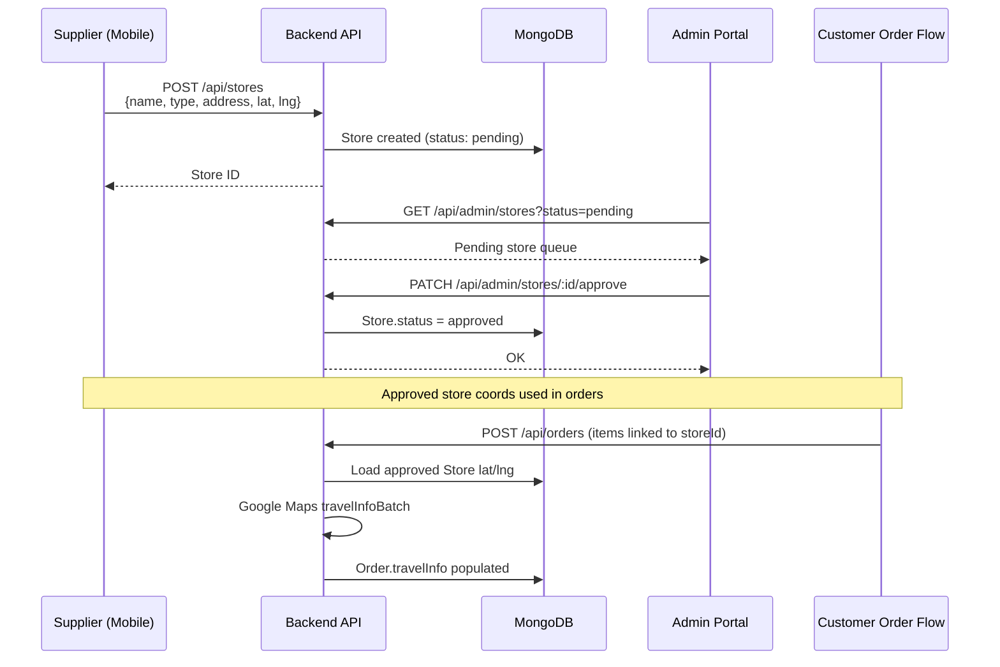
```mermaid
sequenceDiagram
  participant S as Supplier (Mobile)
  participant API as Backend API
  participant DB as MongoDB
  participant A as Admin Portal
  participant C as Customer Order Flow

  S->>API: POST /api/stores<br/>{name, type, address, lat, lng}
  API->>DB: Store created (status: pending)
  API-->>S: Store ID

  A->>API: GET /api/admin/stores?status=pending
  API-->>A: Pending store queue

  A->>API: PATCH /api/admin/stores/:id/approve
  API->>DB: Store.status = approved
  API-->>A: OK

  Note over S,C: Approved store coords used in orders

  C->>API: POST /api/orders (items linked to storeId)
  API->>DB: Load approved Store lat/lng
  API->>API: Google Maps travelInfoBatch
  API->>DB: Order.travelInfo populated
```

| Store Field | Purpose |
|-------------|---------|
| `type` | `store` or `warehouse` |
| `latitude`, `longitude` | Required — map pin on creation |
| `status` | `pending` → `approved` \| `rejected` |
| `supplierId` | Owner supplier |

**Edit rule:** If an approved store is edited by supplier, it may return to **pending** for re-approval.

**Mobile screens:** `SupplierStoresScreen.js`, `SupplierStoreLocationScreen.js`  
**Admin screen:** `admin/src/pages/Stores.jsx`

---

## 13. Admin Portal Roles & Capabilities

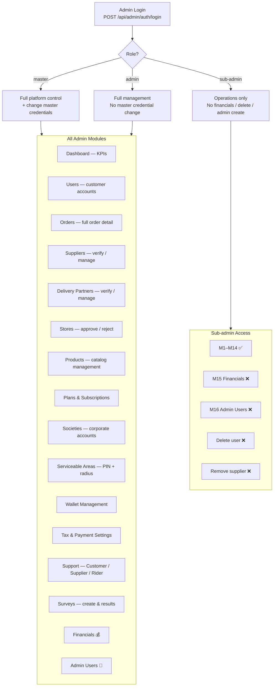
```mermaid
flowchart TB
  Login["Admin Login<br/>POST /api/admin/auth/login"] --> RoleCheck{Role?}

  RoleCheck -->|master| Master["Full platform control<br/>+ change master credentials"]
  RoleCheck -->|admin| AdminRole["Full management<br/>No master credential change"]
  RoleCheck -->|sub-admin| SubAdmin["Operations only<br/>No financials / delete / admin create"]

  Master --> Modules
  AdminRole --> Modules
  SubAdmin --> ModulesLimited

  subgraph Modules["All Admin Modules"]
    M1["Dashboard — KPIs"]
    M2["Users — customer accounts"]
    M3["Orders — full order detail"]
    M4["Suppliers — verify / manage"]
    M5["Delivery Partners — verify / manage"]
    M6["Stores — approve / reject"]
    M7["Products — catalog management"]
    M8["Plans & Subscriptions"]
    M9["Societies — corporate accounts"]
    M10["Serviceable Areas — PIN + radius"]
    M11["Wallet Management"]
    M12["Tax & Payment Settings"]
    M13["Support — Customer / Supplier / Rider"]
    M14["Surveys — create & results"]
    M15["Financials 💰"]
    M16["Admin Users 👤"]
  end

  subgraph ModulesLimited["Sub-admin Access"]
    SL1["M1–M14 ✅"]
    SL2["M15 Financials ❌"]
    SL3["M16 Admin Users ❌"]
    SL4["Delete user ❌"]
    SL5["Remove supplier ❌"]
  end
```

### Admin ↔ Platform Operations Map

| Admin Action | Affects | Mobile Impact |
|--------------|---------|---------------|
| Verify supplier | Supplier onboarding | Supplier dashboard unlocks |
| Verify rider | Rider onboarding | Rider can go online |
| Approve store | Store status | Store coords used in order ETA |
| Manage serviceable areas | ServiceableArea records | Checkout serviceability check |
| Tax settings | PlatformSettings | Order totals, Razorpay amounts |
| Wallet management | Wallet balances | Customer wallet checkout |
| Product management | Product catalog | Customer product browse |

---

## 14. Sample Customer User Journey

### 14.1 Customer Journey Flow Diagram

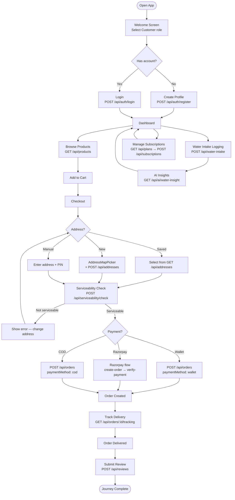
```mermaid
flowchart TD
  A(["Open App"]) --> B["Welcome Screen<br/>Select Customer role"]
  B --> C{Has account?}
  C -->|No| D["Create Profile<br/>POST /api/auth/register"]
  C -->|Yes| E["Login<br/>POST /api/auth/login"]
  D --> F["Dashboard"]
  E --> F

  F --> G["Browse Products<br/>GET /api/products"]
  G --> H["Add to Cart"]
  H --> I["Checkout"]

  I --> J{Address?}
  J -->|Saved| K["Select from GET /api/addresses"]
  J -->|New| L["AddressMapPicker<br/>+ POST /api/addresses"]
  J -->|Manual| M["Enter address + PIN"]

  K --> N["Serviceability Check<br/>POST /api/serviceability/check"]
  L --> N
  M --> N

  N -->|Not serviceable| O["Show error — change address"]
  O --> J
  N -->|Serviceable| P{Payment?}

  P -->|Wallet| Q["POST /api/orders<br/>paymentMethod: wallet"]
  P -->|Razorpay| R["Razorpay flow<br/>create-order → verify-payment"]
  P -->|COD| S["POST /api/orders<br/>paymentMethod: cod"]

  Q --> T["Order Created"]
  R --> T
  S --> T

  T --> U["Track Delivery<br/>GET /api/orders/:id/tracking"]
  U --> V["Order Delivered"]
  V --> W["Submit Review<br/>POST /api/reviews"]
  W --> X(["Journey Complete"])

  F --> Y["Water Intake Logging<br/>POST /api/water-intake"]
  Y --> Z["AI Insights<br/>GET /api/ai/water-insight"]
  Z --> F

  F --> AA["Manage Subscriptions<br/>GET /api/plans → POST /api/subscriptions"]
  AA --> F
```

### 14.2 Customer Journey Steps (Detailed)

| Step | Screen | API / Integration | Outcome |
|------|--------|-------------------|---------|
| 1 | Welcome & Role Selection | — | Choose Customer path |
| 2 | Create Profile / Login | `POST /api/auth/register` or `/login` | JWT token stored |
| 3 | Dashboard | `GET /api/users/me`, `/api/wallet`, `/api/ai/water-insight` | Personalized home + Groq insight |
| 4 | Browse Products | `GET /api/products` | Catalog with supplier info |
| 5 | Cart | Local state | Review items |
| 6 | Checkout — Address | `GET /api/addresses`, Map picker + Google Maps | Delivery location set |
| 7 | Checkout — Serviceability | `POST /api/serviceability/check` + Google Geocoding | Confirm deliverable |
| 8 | Checkout — Payment | Wallet / Razorpay / COD | Payment authorized |
| 9 | Order Placed | `POST /api/orders` or Razorpay verify | Order `in_progress` |
| 10 | Track Delivery | `GET /api/orders/:id/tracking` | Live rider GPS + ETA |
| 11 | Delivered | — | Status `delivered` |
| 12 | Review | `POST /api/reviews` | Product rating |

---

## 15. Multi-Actor Order Fulfillment Journey

This diagram shows how **one order** connects all actors from placement to delivery.

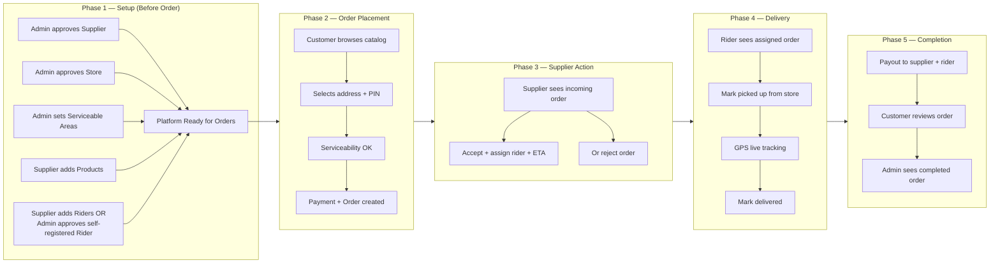
```mermaid
flowchart LR
  subgraph Phase1["Phase 1 — Setup (Before Order)"]
    direction TB
    A1["Admin approves Supplier"]
    A2["Admin approves Store"]
    A3["Admin sets Serviceable Areas"]
    A4["Supplier adds Products"]
    A5["Supplier adds Riders OR<br/>Admin approves self-registered Rider"]
    A1 --> Ready
    A2 --> Ready
    A3 --> Ready
    A4 --> Ready
    A5 --> Ready
    Ready["Platform Ready for Orders"]
  end

  subgraph Phase2["Phase 2 — Order Placement"]
    direction TB
    C1["Customer browses catalog"]
    C2["Selects address + PIN"]
    C3["Serviceability OK"]
    C4["Payment + Order created"]
    C1 --> C2 --> C3 --> C4
  end

  subgraph Phase3["Phase 3 — Supplier Action"]
    direction TB
    S1["Supplier sees incoming order"]
    S2["Accept + assign rider + ETA"]
    S3["Or reject order"]
    S1 --> S2
    S1 --> S3
  end

  subgraph Phase4["Phase 4 — Delivery"]
    direction TB
    R1["Rider sees assigned order"]
    R2["Mark picked up from store"]
    R3["GPS live tracking"]
    R4["Mark delivered"]
    R1 --> R2 --> R3 --> R4
  end

  subgraph Phase5["Phase 5 — Completion"]
    direction TB
    E1["Payout to supplier + rider"]
    E2["Customer reviews order"]
    E3["Admin sees completed order"]
    E1 --> E2 --> E3
  end

  Ready --> Phase2
  Phase2 --> Phase3
  Phase3 --> Phase4
  Phase4 --> Phase5
```

### Swimlane Sequence (Customer · Supplier · Rider · Admin)

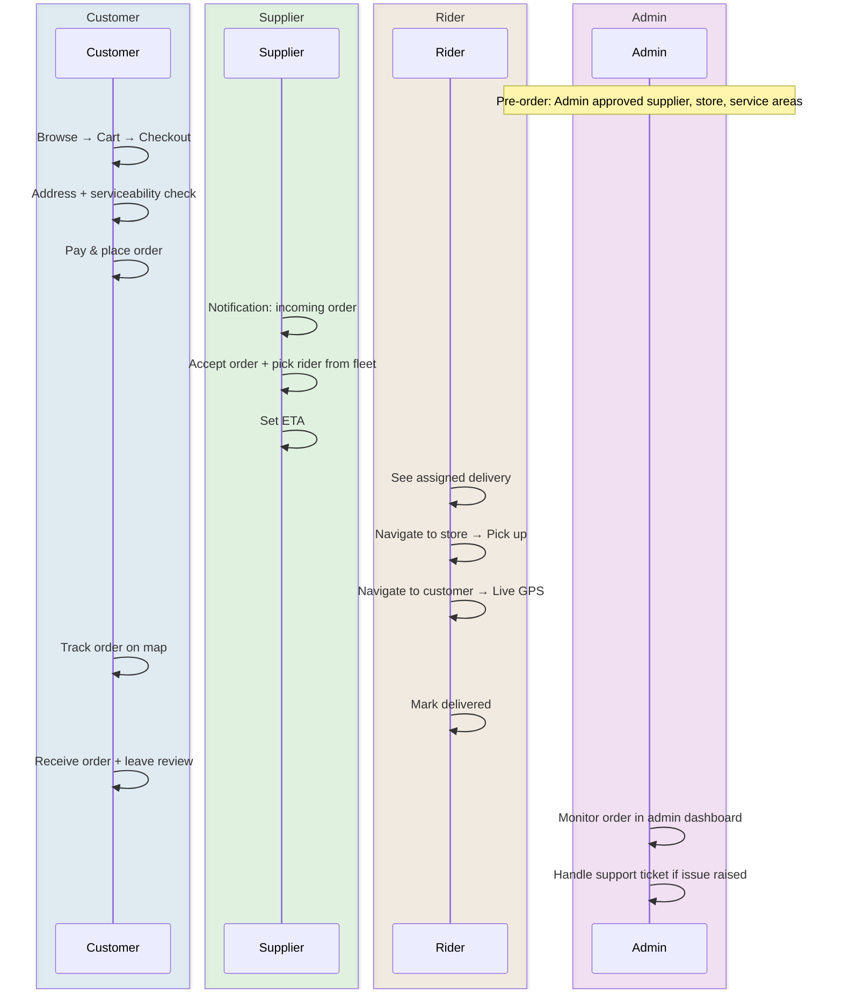
```mermaid
sequenceDiagram
  box rgba(200,230,255,0.3) Customer
    participant C as Customer
  end
  box rgba(200,255,200,0.3) Supplier
    participant S as Supplier
  end
  box rgba(255,230,200,0.3) Rider
    participant R as Rider
  end
  box rgba(255,200,255,0.3) Admin
    participant A as Admin
  end

  Note over A: Pre-order: Admin approved supplier, store, service areas

  C->>C: Browse → Cart → Checkout
  C->>C: Address + serviceability check
  C->>C: Pay & place order

  S->>S: Notification: incoming order
  S->>S: Accept order + pick rider from fleet
  S->>S: Set ETA

  R->>R: See assigned delivery
  R->>R: Navigate to store → Pick up
  R->>R: Navigate to customer → Live GPS

  C->>C: Track order on map

  R->>R: Mark delivered

  C->>C: Receive order + leave review

  A->>A: Monitor order in admin dashboard
  A->>A: Handle support ticket if issue raised
```

---

## 16. Key API Reference by Actor

### Customer

| Action | Method | Endpoint |
|--------|--------|----------|
| Register / Login | POST | `/api/auth/register`, `/api/auth/login` |
| Profile | GET/PUT | `/api/users/me` |
| Addresses | CRUD | `/api/addresses` |
| Serviceability | POST | `/api/serviceability/check` |
| Products | GET | `/api/products` |
| Create order | POST | `/api/orders` |
| Razorpay pay | POST | `/api/payments/razorpay/create-order`, `/verify-payment` |
| Track order | GET | `/api/orders/:id/tracking` |
| Cancel order | PATCH | `/api/orders/:id/cancel` |
| Wallet | GET/POST | `/api/wallet`, `/api/wallet/credit` |
| AI insights | GET/POST | `/api/ai/water-insight`, `/api/ai/ask` |
| Support | CRUD | `/api/customer-support/tickets` |

### Supplier

| Action | Method | Endpoint |
|--------|--------|----------|
| Register | POST | `/api/auth/register-supplier` |
| Profile | GET/PATCH | `/api/suppliers/me` |
| Stores | CRUD | `/api/stores` |
| Products | CRUD | `/api/products` |
| Add rider | POST | `/api/supplier/delivery-partners` |
| Incoming orders | GET | `/api/supplier/orders/incoming` |
| Accept / Reject | PATCH | `/api/supplier/orders/:id/accept`, `/reject` |
| Assign rider | PATCH | `/api/supplier/orders/:id/assign-rider` |
| Financials | GET | `/api/supplier/financials` |

### Delivery Partner (Rider)

| Action | Method | Endpoint |
|--------|--------|----------|
| Register | POST | `/api/auth/register-delivery` |
| Go online | PATCH | `/api/delivery-partners/me/online` |
| Share location | PATCH | `/api/delivery-partners/me/location` |
| Incoming orders | GET | `/api/delivery-partners/orders/incoming` |
| Pick up | PATCH | `/api/delivery-partners/orders/:id/picked-up` |
| Live GPS | PATCH | `/api/delivery-partners/orders/:id/location` |
| Deliver | PATCH | `/api/delivery-partners/orders/:id/delivered` |

### Admin

| Action | Method | Endpoint |
|--------|--------|----------|
| Login | POST | `/api/admin/auth/login` |
| Verify supplier | PATCH | `/api/admin/suppliers/:id/verify` |
| Verify rider | PATCH | `/api/admin/delivery-partners/:id/verify` |
| Approve store | PATCH | `/api/admin/stores/:id/approve` |
| Serviceable areas | CRUD | `/api/admin/serviceable-areas` |
| All orders | GET | `/api/admin/orders` |
| Financials | GET | `/api/admin/financials` |
| Admin users | CRUD | `/api/admin/admins` |

---

## 17. Data Models (Core Entities)

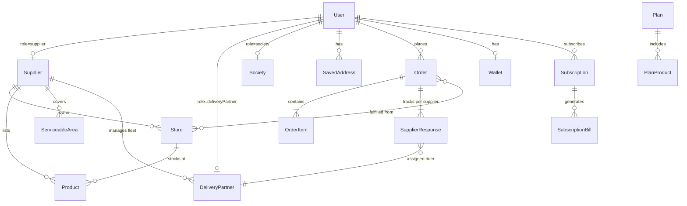
```mermaid
erDiagram
  User ||--o| Supplier : "role=supplier"
  User ||--o| DeliveryPartner : "role=deliveryPartner"
  User ||--o| Society : "role=society"
  User ||--o{ SavedAddress : "has"
  User ||--o{ Order : "places"
  User ||--o| Wallet : "has"

  Supplier ||--o{ Store : "owns"
  Supplier ||--o{ Product : "lists"
  Supplier ||--o{ ServiceableArea : "covers"
  Supplier ||--o{ DeliveryPartner : "manages fleet"

  Order ||--|{ OrderItem : "contains"
  Order ||--|{ SupplierResponse : "tracks per supplier"
  SupplierResponse }o--|| DeliveryPartner : "assigned rider"

  Store ||--o{ Product : " stocks at"
  Order }o--o{ Store : "fulfilled from"

  Plan ||--o{ PlanProduct : "includes"
  User ||--o{ Subscription : "subscribes"
  Subscription ||--o{ SubscriptionBill : "generates"
```

### Entity Summary

| Model | File | Key Relationships |
|-------|------|-------------------|
| User | `models/User.js` | Central auth entity; roles: customer, supplier, deliveryPartner, society, admin, sub-admin |
| Supplier | `models/Supplier.js` | Linked to User; onboarding, commission, geo |
| DeliveryPartner | `models/DeliveryPartner.js` | Linked to User + optional Supplier fleet |
| Store | `models/Store.js` | Supplier location; approval workflow |
| Product | `models/Product.js` | Catalog item; supplier + store linkage |
| Order | `models/Order.js` | Full lifecycle; supplierResponses[], travelInfo[] |
| SavedAddress | `models/SavedAddress.js` | Customer delivery addresses |
| ServiceableArea | `models/ServiceableArea.js` | PIN + radius per supplier |
| Wallet | `models/Wallet.js` | Customer + platform balances |
| Subscription | `models/Subscription.js` | Recurring water plans |

---

## Related Documentation

| Document | Path | Contents |
|----------|------|----------|
| Deployment Guide | `docs/DEPLOYMENT-GUIDE.md` | AWS EC2 setup, env vars, PM2 |
| Admin Ubuntu Setup | `admin/RUN-ON-UBUNTU.md` | Admin portal deployment |
| Local Mobile Setup | `mobile/LOCAL_SETUP.md` | Expo + local backend |
| Customer Journey Catalog | `docs/customer-journey-catalog.json` | Screen-by-screen customer flow |
| AWS Production Config | `config/aws-production.json` | Production URLs |

---

## Diagram Rendering

All diagrams use [Mermaid](https://mermaid.js.org/) syntax. They render automatically in:

- GitHub / GitLab markdown preview
- VS Code with a Mermaid extension
- [Mermaid Live Editor](https://mermaid.live)

For PDF export, use a Mermaid-capable markdown converter or paste diagrams into Mermaid Live Editor.
